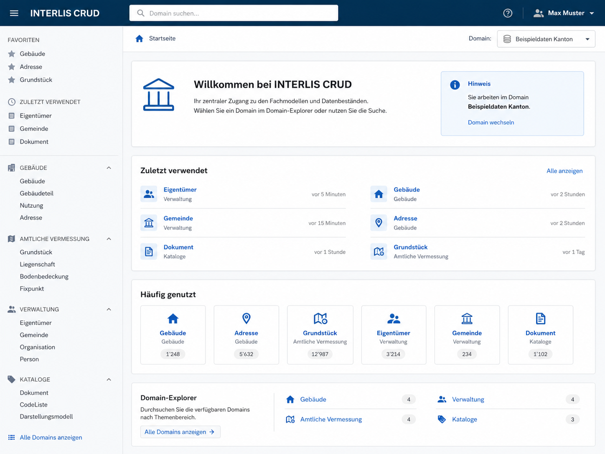
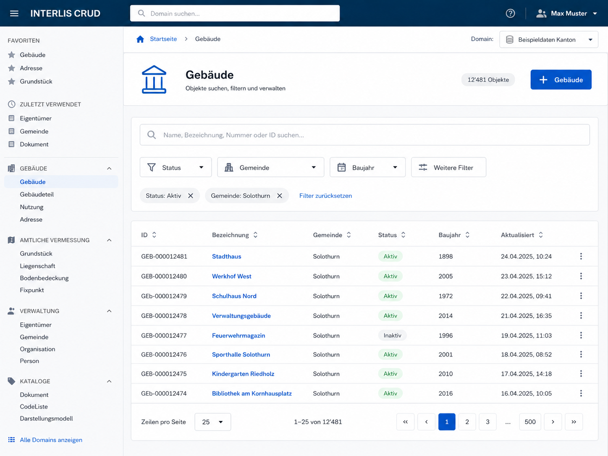
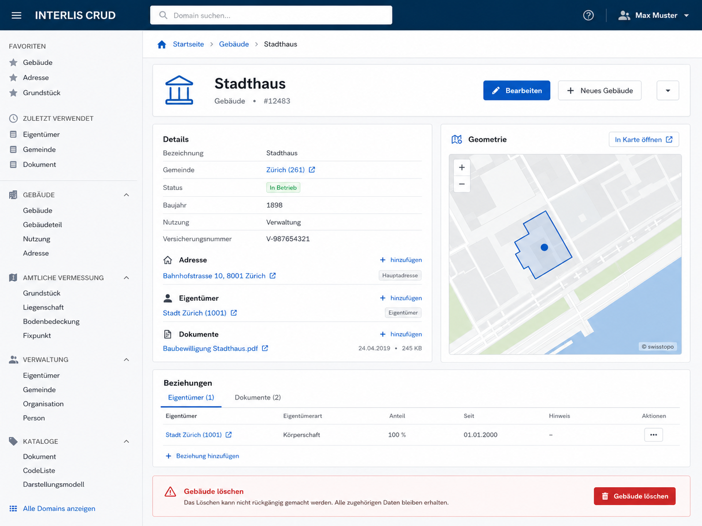
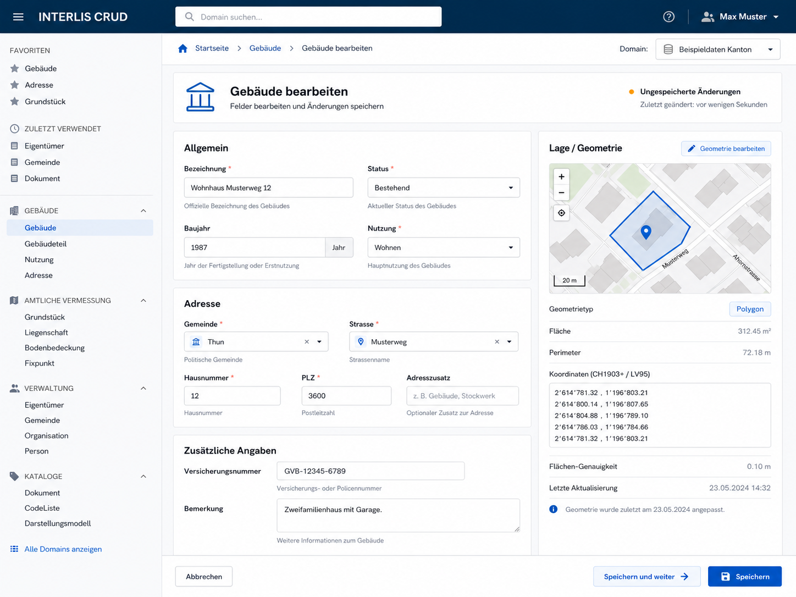
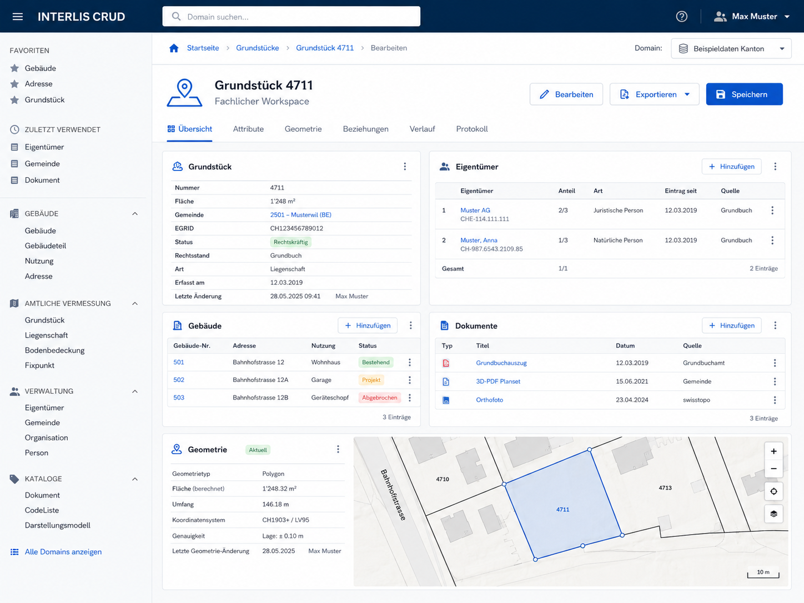

# ili2grails – Bootstrap UI/UX Redesign

## Spezifikation und Umsetzungsanweisung für einen LLM Coding Agent

**Stand:** 2026-07-16
**Repository:** `edigonzales/ili2grails`
**Zielbereich:** Grails-Target, UI-Theme `bootstrap`
**Nicht betroffen:** Grails-Default-Scaffolding/UI-Theme `default`
**Umsetzungsmodus:** phasenweise, jede Phase muss funktionsfähig und umfassend getestet abschliessen

---

## 0. Status und Arbeitsweise dieses Dokuments

Dieses Dokument ist gleichzeitig:

1. fachliche und technische Spezifikation,
2. Architekturleitlinie für die UI-Weiterentwicklung,
3. phasenweiser Umsetzungsplan,
4. Arbeitsanweisung für einen LLM Coding Agent,
5. Fortschrittsdokument während der Umsetzung.

Der Coding Agent muss dieses Dokument während der Umsetzung aktualisieren. Für jede Phase ist genau einer der folgenden Statuswerte zu verwenden:

- `NOT_STARTED`
- `IN_PROGRESS`
- `BLOCKED`
- `DONE`

### Phasenstatus

| Phase | Inhalt | Status |
|---|---|---|
| Phase 0 | Bestandsaufnahme, UI-Metadaten und Architekturgrundlage | `DONE` |
| Phase 1 | Application Shell, Navigation und Domain Explorer | `DONE` |
| Phase 2 | Domain-Liste, Suche, Filter und Tabellen-UX | `DONE` |
| Phase 3 | Objektansicht als Domain Workspace | `DONE` |
| Phase 4 | Create/Edit-Formulare und Editor-UX | `DONE` |
| Phase 5 | Fachliche Multi-Domain-Workspaces | `DONE` |
| Phase 6 | Multi-Domain-Edit mit einem gemeinsamen Save | `DONE` |
| Phase 7 | Härtung, Regression, E2E, Dokumentation und Abnahme | `DONE` |

### Verbindliche Arbeitsregel für den Coding Agent

Vor **jeder** Codeänderung muss der Agent:

1. dieses gesamte Dokument vollständig analysieren,
2. `AGENTS.md` vollständig lesen und befolgen,
3. die aktuelle `README.md` als Architektur- und Dokumentationsquelle analysieren,
4. die tatsächlich vorhandenen Klassen, Templates, Tests und Generatorpfade im Repository ermitteln,
5. vorhandene Implementierungen wiederverwenden statt parallele Lösungen zu bauen,
6. Widersprüche zwischen diesem Plan und dem aktuellen Repositoryzustand sichtbar dokumentieren.

Der Repositoryzustand kann sich während der Umsetzung weiterentwickeln. Deshalb sind die in diesem Dokument genannten Klassen- und Dateinamen als präzise Zielrichtung zu verstehen, aber vor Änderungen gegen den tatsächlichen Stand zu verifizieren.

---

# 1. Ausgangslage

`ili2grails` erzeugt aus dem framework-agnostischen INTERLIS-/ili2db-Metamodell unter anderem Grails-Domains und eine Grails-CRUD-Anwendung.

Für die Grails-Oberfläche existieren zwei Modi:

- `default`: Grails-Default-Scaffolding; bleibt unverändert.
- `bootstrap`: eigener, durch `ili2grails` verwalteter UI-Overlay; dieser Modus wird in diesem Vorhaben grundlegend verbessert.

Der Bootstrap-Modus besitzt bereits eine erhebliche funktionale Basis. Nach aktuellem Stand gehören unter anderem dazu:

- eigene Scaffolding-Templates für `index`, `show`, `create`, `edit` und Form-Partials,
- ein eigenes `main.gsp`-Layout,
- zentrale CSS- und JavaScript-Assets,
- Bootstrap,
- OpenLayers und Geometrie-Editor,
- serverseitige Suche,
- Paging und Sorting,
- typisierte Filter-Grundlagen,
- Relationship-Auswahl,
- Association-Sections,
- Quick-Add und kontextuelle Association-Formulare,
- kontextuelle Redirects,
- generische Laufzeitunterstützung in `InterlisCrudControllerSupport`,
- `InterlisNavigationSupport`,
- `InterlisTableModel`,
- Association Query-/Command-Services und Registry-Support.

Die bestehende technische Basis soll **nicht ersetzt**, sondern strukturell weiterentwickelt werden.

Das Ziel ist ausdrücklich **keine SPA**.

Die Anwendung bleibt eine klassische Grails-Anwendung mit:

- serverseitigen Controllern,
- GSP,
- normalen Links,
- GET-basierten Such- und Filterseiten,
- normalen HTML-Forms,
- Post/Redirect/Get,
- kleinen, gezielten JavaScript-Erweiterungen für Progressive Enhancement,
- Bootstrap-Komponenten,
- bestehenden JSON-Endpunkten dort, wo Autocomplete oder Association-Interaktionen dies sinnvoll machen.

Nicht einzuführen sind React, Vue, Angular oder ein vergleichbares clientseitiges SPA-Framework.

---

# 2. Zielbild

Der Bootstrap-Modus soll sich nicht mehr wie optisch angepasstes Grails-Scaffolding anfühlen, sondern wie eine konsistente, generische **Datenmanagement-Anwendung für INTERLIS-Datenmodelle**.

Die UI muss drei Ebenen klar unterscheiden:

## 2.1 Application Navigation

Der Benutzer muss auch bei sehr vielen generierten Domainklassen schnell verstehen:

- in welchem INTERLIS-Modell er sich befindet,
- in welchem Topic eine Klasse liegt,
- welche Domainklassen verfügbar sind,
- wie er schnell zu einer anderen Domainklasse wechselt.

## 2.2 Domain Workspace

Für jede generierte Domainklasse muss eine hochwertige generische Arbeitsoberfläche existieren:

- suchen,
- filtern,
- sortieren,
- browsen,
- Detailobjekte verstehen,
- Beziehungen verfolgen,
- Beziehungen verwalten,
- Objekte erstellen und bearbeiten,
- Geometrien anzeigen und bearbeiten.

## 2.3 Fachliche Workspaces

Zusätzlich zur generischen CRUD-Sicht muss das Framework einen klaren Erweiterungspfad für fachliche Arbeitsseiten anbieten, die mehrere Domainklassen auf einer Seite kombinieren.

Beispiel:

- Grundstück,
- Eigentümer,
- Gebäude,
- Dokumente,
- Geometrie

werden in einem fachlichen Workspace zusammen dargestellt und bei Bedarf gemeinsam bearbeitet.

Der generische CRUD bleibt dabei immer als funktionierendes Sicherheitsnetz erhalten.

---

# 3. Zentrale UX-Prinzipien

## 3.1 Server-rendered first

Die UI muss auch ohne komplexen Client-State funktionieren.

Grundsatz:

```text
Controller
  -> View Model
  -> GSP
  -> normale Links und Forms
```

JavaScript darf die Bedienung verbessern, aber nicht die fachliche Grundfunktion besitzen.

## 3.2 Progressive Enhancement

Geeignete JavaScript-Erweiterungen sind beispielsweise:

- Sidebar ein-/ausklappen,
- Domain-Finder/Command-Palette,
- Favoriten und zuletzt verwendete Domains,
- Autocomplete für Relationships,
- Dirty-Form-Warnung,
- Bootstrap-Offcanvas für Filter,
- Delete-Confirm-Dialoge,
- Geometrieeditor.

Eine Funktion, die ohne JavaScript sinnvoll als normale Seite oder normales Formular funktionieren kann, soll grundsätzlich einen serverseitigen Fallback behalten.

## 3.3 INTERLIS-Semantik nutzen

`ili2grails` besitzt Informationen, die ein normales CRUD-Framework nicht besitzt:

- Modell,
- Topic,
- Klasse,
- Dokumentation,
- Labels,
- Units,
- Enumerationen,
- Beziehungen,
- Associations,
- Compositions,
- Geometrien.

Diese Informationen sollen in der UI sichtbar nutzbar gemacht werden.

## 3.4 Technische Domains nicht unnötig exponieren

Association-Domains oder andere technisch notwendige Hilfsdomains sollen nicht automatisch als gleichwertige Hauptnavigation erscheinen, wenn sie fachlich besser aus dem Kontext eines Owner-Objekts bearbeitet werden.

Die bereits vorhandene Navigation-/Association-Semantik ist weiterzuverwenden.

## 3.5 Beziehungen sind Navigation

Ein verknüpftes Objekt soll in der Regel anklickbar sein.

Beispiele:

- von einem Gebäude zur Gemeinde,
- vom Grundstück zum Eigentümer,
- vom Eigentümer zu einer Organisation,
- von einer Association zu den beteiligten Objekten.

Der Benutzer soll sich entlang des Datenmodells bewegen können.

## 3.6 Automatische Defaults plus gezielte Konfiguration

Das Framework muss ohne zusätzliche Konfiguration eine gute generische UI erzeugen.

Für produktive Fachanwendungen müssen relevante Darstellungsaspekte jedoch konfigurierbar sein, insbesondere:

- sichtbare Listen-Spalten,
- primäre Suchfelder,
- prominente Filter,
- Form-Sektionen,
- Feldreihenfolge,
- sichtbare Relationships,
- fachliche Labels.

Das INTERLIS-Modell bleibt die Wahrheit über die Datenstruktur.

Eine UI-Konfiguration darf keine neue fachliche Datenwahrheit einführen, sondern nur Darstellung und Bedienung konfigurieren.

## 3.7 No-frills Bootstrap statt eigener Marken-Farbwelt

Der neue `bootstrap`-Modus soll bewusst **keine eigene dominierende Markenfarbwelt** definieren.

Verbindlich gilt:

- das heute im Bootstrap-Overlay verwendete Rot darf **nicht** als Haupt-/Primärfarbe weitergeführt werden,
- wenn Bootstrap verwendet wird, sollen seine Standard-Komponenten und seine Standard-Farbsemantik möglichst direkt und zurückhaltend genutzt werden,
- `primary`, `secondary`, `success`, `warning`, `danger` usw. behalten ihre semantische Bootstrap-Rolle,
- `danger`/Rot bleibt für tatsächlich destruktive oder fehlerhafte Zustände zulässig, ist aber **keine Brand-/Navigations-/Primärfarbe**,
- keine neue eigene grosse Palette nur zur optischen Individualisierung einführen,
- keine unnötigen Theme-Abstraktionsschichten bauen, wenn normales Bootstrap-CSS genügt,
- die UI soll neutral, nüchtern und funktional wirken.

Die Mockups zeigen stellenweise eine blaue Hauptfarbe. Diese ist **nicht** als verpflichtende eigene Brand-Farbe zu verstehen. Die Implementierung soll sich am unveränderten bzw. nur minimal angepassten Bootstrap-Look orientieren.

### Legacy-CSS-Tokens `--dp-*`

Alle bestehenden CSS Custom Properties mit Präfix `--dp-*` sind im Zuge des Bootstrap-Redesigns zu entfernen.

Verbindlich:

- keine neuen `--dp-*`-Variablen hinzufügen,
- bestehende `--dp-*`-Variablen nicht nur auf neue Namen aliasen,
- abhängige Styles auf Bootstrap-Variablen, bestehende native CSS-Werte oder wenige klar begründete `--ili-*`-spezifische Variablen umstellen,
- neue `--ili-*`-Variablen nur dann einführen, wenn tatsächlich eine framework-spezifische, wiederverwendete Design- oder Layout-Konstante benötigt wird,
- am Ende des Vorhabens darf der gemanagte Bootstrap-UI-Code keine `--dp-*`-Vorkommen mehr enthalten.

## 3.8 Icon-System: Bootstrap Icons als eingebettete SVGs

Für generische UI-Icons sind **Bootstrap Icons** zu verwenden.

Verbindlich:

- Icons werden als eingebettete/inline SVGs gerendert,
- kein Bootstrap-Icons-Webfont,
- kein externes CDN,
- keine Runtime-Abhängigkeit auf einen fremden Icon-Server,
- keine zufällig selbst gezeichneten SVGs für Standardaktionen wie Suche, Bearbeiten, Löschen, Hinzufügen, Filter, Navigation, Chevron, Person, Gebäude oder Dokument,
- Icon-only Buttons benötigen weiterhin `aria-label` und sinnvolle `title`-Texte, wo hilfreich,
- die Icon-Verwendung soll zentral wiederverwendbar sein, beispielsweise über ein kleines GSP-Template, TagLib-/Helper-Konzept oder klar verwaltete SVG-Partials, statt dieselben SVG-Pfade unkontrolliert in viele Templates zu kopieren.

Domain- oder fachlich spezifische Symbole dürfen nur dann ausserhalb von Bootstrap Icons liegen, wenn Bootstrap Icons dafür keine sinnvolle Darstellung bietet. Solche Ausnahmen sind sparsam und dokumentiert zu halten.

## 3.9 Login-/Benutzerbereich nur vorbereiten

Die Application Shell darf oben rechts einen **vorbereiteten Platz für einen zukünftigen Login-/Benutzerbereich** besitzen. Eine Authentifizierungs- oder Benutzer-Schicht existiert im aktuellen Vorhaben jedoch noch nicht.

Daraus folgt:

- keine Login-Funktion implementieren,
- keine Security-/Session-Schicht nur für die neue UI einführen,
- keine Annahme machen, dass ein aktueller Benutzer existiert,
- kein `User`-Domainmodell erzeugen,
- kein Benutzername wie `Max Muster` hart codieren,
- kein Dummy-Login vortäuschen.

Zulässig ist eine neutrale, optionale Shell-Struktur bzw. ein klarer Extension Point, der später mit Authentifizierungsdaten befüllt werden kann. Solange keine Authentifizierung integriert ist, darf dieser Bereich leer, verborgen oder mit einer neutralen nicht-interaktiven Platzhalterstruktur gerendert werden.

---

# 4. Terminologie

In diesem Dokument gilt:

## Modell

Ein INTERLIS-Modell.

## Topic

Ein INTERLIS-Topic innerhalb eines Modells.

## Domain / Domainklasse

Eine generierte Grails-Domainklasse, die fachlich auf einer INTERLIS-Klasse basiert.

Der Begriff `Domain` in der UI bezieht sich **nicht** auf Tenant, Datenbestand oder Datenbankkontext.

## Domain Workspace

Die generische List-/Show-/Create-/Edit-Arbeitsoberfläche einer einzelnen Domainklasse.

## Fachlicher Workspace

Eine explizit entwickelte oder konfigurierte Seite, die mehrere Domainklassen für einen fachlichen Arbeitsvorgang kombiniert.

## Multi-Domain-Edit

Ein fachlicher Workspace, in dem Änderungen an mehreren Domainobjekten mit **einem gemeinsamen Submit** und **einer gemeinsamen Transaktion** gespeichert werden.

---

# 5. Mockups als visuelle Referenz

Die folgenden Mockups gehören zu dieser Spezifikation und sind im Verzeichnis `mockups/` enthalten.

## 5.1 Application Shell und Dashboard



Referenz für:

- globale Application Shell,
- linke Navigation,
- globale Domain-Suche,
- Gruppierung nach Topics,
- Favoriten,
- zuletzt verwendete Domains,
- Domain Explorer.

## 5.2 Domain-Liste mit Suche und Filter



Referenz für:

- prominente Suche,
- Quick Filters,
- aktive Filter-Chips,
- Tabellenlayout,
- Pagination,
- Zeilen-pro-Seite-Auswahl,
- primäre Create-Aktion.

## 5.3 Objektansicht / Domain Workspace



Referenz für:

- Object Header,
- Detailinformationen,
- Relationships,
- Associations,
- Geometrie,
- kontextuelle Aktionen,
- Danger Zone.

## 5.4 Create/Edit-Formular



Referenz für:

- Form-Sektionen,
- Inline-Dokumentation,
- Units,
- Relationship Picker,
- Geometrieeditor,
- Sticky Save Actions,
- Dirty-State-Anzeige.

## 5.5 Fachlicher Multi-Domain-Workspace



Referenz für:

- fachlich gruppierte Multi-Domain-Darstellung,
- mehrere verwandte Objektarten auf einer Seite,
- wiederverwendbare Tabellen-/Section-Komponenten,
- Geometrie im fachlichen Kontext.

### 5.6 Priorität der Anforderungen

Die Mockups sind **keine pixelgenauen Spezifikationen**.

Bei Widersprüchen gilt folgende Priorität:

1. schriftliche Anforderungen dieses Dokuments,
2. tatsächliche fachliche Semantik des Repositorys und des INTERLIS-Modells,
3. vorhandene Sicherheits- und Architekturregeln,
4. visuelle Mockups.

Insbesondere sind folgende Mockup-Details **nicht normativ**:

- erfundene Beispielwerte,
- allenfalls fachlich falsche Delete-Texte,
- der im Bild verwendete Begriff `Domain: Beispieldaten Kanton`,
- beispielhafte Tabs `Verlauf` oder `Protokoll`,
- die konkrete Icon-Auswahl einzelner Mockup-Elemente; die Implementierung verwendet für generische UI-Aktionen Bootstrap Icons als eingebettete SVGs,
- exakte Farben und Pixelabstände; insbesondere ist die blaue Mockup-Farbwelt keine verpflichtende Brand-Farbe,
- künstliche Counts auf dem Dashboard.

---

# 6. Expliziter Scope

## 6.1 In Scope

Folgende Funktionen gehören zum Vorhaben:

1. neue Application Shell für den Bootstrap-Modus,
2. skalierbare Navigation für viele Domainklassen,
3. Gruppierung nach INTERLIS-Modell und Topic,
4. globale Domain-Suche,
5. Domain Explorer,
6. Favoriten und zuletzt verwendete Domains als clientseitige Komfortfunktion,
7. überarbeitete Domain-Listenansicht,
8. prominent sichtbare serverseitige Suche,
9. verbesserte typisierte Filter,
10. Quick Filters und erweiterter Filterbereich,
11. aktive Filter-Chips,
12. gute Tabellen-Defaults,
13. konfigurierbare Tabellen-/Such-/Form-Darstellung,
14. Objektansicht als Domain Workspace,
15. bessere Integration von Relationships und Associations,
16. verbesserte Create-/Edit-Formulare,
17. Form-Sektionen,
18. Inline-Dokumentation und Units,
19. Sticky Save Actions,
20. `Speichern und weiter`,
21. wiederverwendbare GSP-Komponenten für fachliche Workspaces,
22. definierter Erweiterungspfad für Multi-Domain-Workspaces,
23. **Multi-Domain-Edit mit einem gemeinsamen Save und einer Transaktion**,
24. Browser-E2E-Abdeckung der wesentlichen Benutzerpfade,
25. vorbereiteter, optionaler Shell-Slot für eine spätere Login-/Benutzerintegration ohne Implementierung einer Authentifizierungsschicht,
26. konsequente Nutzung von Bootstrap Icons als eingebettete SVGs für generische UI-Icons,
27. Entfernung aller Legacy-CSS-Custom-Properties `--dp-*` aus dem gemanagten Bootstrap-UI-Code,
28. aktualisierte README-Dokumentation.

## 6.2 Out of Scope

Folgende Themen sind ausdrücklich nicht Teil dieses Vorhabens:

- Änderung oder Modernisierung des UI-Themes `default`,
- SPA-Framework,
- React, Vue, Angular,
- generischer Workflow-/BPM-Engine-Ersatz,
- Implementierung einer Authentifizierungs-, Login-, Session- oder Benutzer-Schicht; nur ein vorbereiteter UI-/Extension-Slot in der Application Shell ist in scope,
- Autorisierung,
- Rollen-/Rechtemodell,
- Tenant-Management,
- generische Dateiverwaltung,
- automatisches Fachprozess-Design aus INTERLIS,
- automatische Generierung beliebiger fachlicher Multi-Domain-Transaktionen,
- Offline-Modus,
- kollaboratives Echtzeit-Editing.

## 6.3 Audit / Verlauf – ausdrücklich OUT OF SCOPE

**Audit, Änderungsverlauf, Historisierung und Protokollierung sind explizit out of scope.**

In diesem Vorhaben dürfen insbesondere **nicht** eingeführt werden:

- Hibernate Envers,
- eigene Audit-Tabellen,
- automatische Change-Event-Persistierung,
- Benutzer-Audit-Trails,
- Objekt-Diff-Historien,
- Verlauf-Timeline,
- Protokollseiten,
- Audit-Tabs,
- Versionierungs-UI,
- Restore-/Rollback-Funktion.

Die im Multi-Domain-Mockup sichtbaren Tabs `Verlauf` und `Protokoll` sind rein illustrativ und dürfen nicht als Requirement interpretiert werden.

Bestehende Daten wie `dateCreated`, `lastUpdated` oder fachliche Änderungsattribute dürfen angezeigt werden, **wenn sie bereits im konkreten Datenmodell existieren**. Das Framework darf solche Attribute nicht erfinden oder neue Audit-Persistenz einführen.

Die Architektur soll zukünftiges Audit nicht unnötig blockieren. Es ist jedoch keine Audit-Abstraktion auf Vorrat zu implementieren, solange sie für die aktuelle UI nicht benötigt wird.

---

# 7. Verbindliche technische Leitplanken

## 7.1 Core bleibt framework-agnostisch

UI-spezifische Metadaten und Grails-spezifische View-Modelle gehören grundsätzlich in `target-grails` oder in den generierten Grails-Runtime-Code.

Das `core`-Modul darf nur geändert werden, wenn tatsächlich eine allgemeine, framework-neutrale Metainformation fehlt.

Vor einer Core-Änderung muss der Agent dokumentieren:

1. welche Information fehlt,
2. warum sie nicht aus der bestehenden Core-IR abgeleitet werden kann,
3. warum die Ergänzung framework-neutral ist,
4. welche anderen Targets dadurch betroffen sind.

## 7.2 Bestehende Runtime-Funktionalität wiederverwenden

Insbesondere sind bestehende Funktionen für folgende Bereiche zuerst zu analysieren und weiterzuverwenden:

- `InterlisCrudControllerSupport`,
- `InterlisNavigationSupport`,
- `InterlisTableModel`,
- `InterlisRelationshipOptions`,
- `InterlisAssociationRegistrySupport`,
- `InterlisAssociationContextSupport`,
- `InterlisAssociationQueryService`,
- `InterlisAssociationCommandService`,
- Geometrie-Binder und Geometrie-Metadaten,
- vorhandene Association-Templates,
- vorhandene Form-UX-JavaScript-Funktionen.

Keine zweite parallele Relationship-, Search-, Association- oder Navigation-Engine bauen.

## 7.3 Kein Monolith im Controller-Support

`InterlisCrudControllerSupport` ist bereits umfangreich.

Neue grössere Funktionen sollen nicht unkontrolliert in diese Klasse eingebaut werden.

Bei den neuen Bereichen sind kleine, fokussierte Runtime-Komponenten vorzuziehen, beispielsweise:

- UI-Descriptor-Support,
- Navigation-Modell,
- List Query Support,
- Filter Parsing,
- Workspace View Models.

Öffentliche Controller-Actions können weiterhin in `InterlisCrudControllerSupport` delegieren.

## 7.4 Kein unnötiges JavaScript

JavaScript-Code muss:

- fokussiert,
- klein,
- ohne Framework-Abhängigkeit,
- CSP-kompatibel,
- testbar

bleiben.

Inline-JavaScript ist zu vermeiden.

## 7.5 Security darf nicht regressieren

Bestehende Security Header und CSP dürfen durch die UI-Arbeiten nicht aufgeweicht werden.

Keine Einführung von:

- `unsafe-inline`,
- `unsafe-eval`,
- unkontrolliertem HTML aus Modellmetadaten,
- ungeprüfter Mass-Assignment-Logik,
- dynamischer Klassenauflösung aus Request-Parametern ohne Whitelist.

## 7.6 Bestehende CLI-Kompatibilität erhalten

Vorhandene CLI-Optionen wie insbesondere:

- `--grails-ui-theme default|bootstrap`,
- Association-UI-Optionen,
- Map-Editor-Konfiguration

müssen kompatibel bleiben.

Neue UI-Konfiguration soll additive Defaults besitzen.

---

# 8. Zielarchitektur der UI-Metadaten

Die UI benötigt eine zentrale, konsistente Beschreibung pro generierter Domainklasse.

## 8.1 `InterlisUiRegistry`

Im Grails-Target soll eine generierte Registry eingeführt werden, beispielsweise:

```text
ch.interlis.generator.grails.generated.InterlisUiRegistry
```

Die endgültige Benennung ist gegen die bestehende Registry-Architektur zu prüfen.

Die Registry soll mindestens folgende Informationen pro Domainklasse bereitstellen, soweit sie aus der Core-IR sicher verfügbar sind:

```groovy
[
    domainClassName  : "ch.example.Building",
    controller       : "building",
    iliName          : "MyModel.Buildings.Building",
    modelName        : "MyModel",
    topicName        : "Buildings",
    className        : "Building",
    label            : "Building",
    navigationVisible: true,
    associationDomain: false
]
```

Es darf keine Information durch fehleranfälliges String-Parsen rekonstruiert werden, wenn das Metamodell sie bereits strukturiert enthält.

## 8.2 Runtime-Descriptor

Ein Runtime-Support soll die generierten Metadaten mit Grails-/GORM-Laufzeitinformationen und optionaler App-Konfiguration zu einem `DomainUiDescriptor` zusammenführen.

Empfohlene Verantwortlichkeit:

```text
InterlisUiDescriptorSupport
```

Ein Descriptor soll konzeptionell Informationen liefern für:

- Navigation,
- Label und Plural-Label,
- Object Display Label,
- Listen-Spalten,
- Suchfelder,
- Filterdefinitionen,
- prominente Filter,
- Form-Sektionen,
- Detail-Sektionen,
- Relationship-Sichtbarkeit,
- Geometrie-Sichtbarkeit.

Nicht jede Eigenschaft muss als starre Java-/Groovy-Klasse implementiert werden, wenn eine kleinere immutable Struktur sinnvoller ist. Die API muss jedoch zentral und testbar sein.

## 8.3 UI-Konfiguration

Die automatisch abgeleitete UI muss überschreibbar sein.

Bevorzugt wird eine Grails-native Konfiguration unter dem Namespace:

```yaml
ili2grails:
  ui:
    appTitle: "Fachdatenverwaltung"
    domains:
      - iliName: "MyModel.Buildings.Building"
        label: "Gebäude"
        list:
          columns:
            - identifier
            - name
            - municipality
            - status
          searchFields:
            - identifier
            - name
          prominentFilters:
            - status
            - municipality
        form:
          sections:
            - title: "Allgemein"
              fields:
                - name
                - status
                - constructionYear
            - title: "Adresse"
              fields:
                - municipality
                - street
```

Die genaue Konfigurationsform ist vor Implementierung gegen Grails Config und die bestehenden Generator-Konventionen zu validieren.

Wichtig:

- keine Schlüsselstrategie verwenden, bei der Punkte in vollständigen Klassennamen unkontrolliert als YAML-Pfade interpretiert werden,
- unbekannte Domain-/Feldreferenzen müssen mit aussagekräftigem Kontext diagnostiziert werden,
- Defaults müssen ohne Konfiguration vollständig funktionieren.

---

# 9. Zielbild Application Shell

## 9.1 Hauptlayout

Das Bootstrap-`main.gsp` erhält eine echte Application Shell:

- Topbar,
- globale Domain-Suche,
- linke Sidebar,
- Breadcrumb-/Kontextzeile,
- Hauptinhalt.

Desktop:

```text
+-------------------------------------------------------------+
| App | Domain suchen...               Login/User Slot (*) |
+------------------+------------------------------------------+
| Sidebar          | Breadcrumb                               |
|                  |                                          |
| Favoriten        | Hauptinhalt                              |
| Zuletzt          |                                          |
| Modell / Topics  |                                          |
|                  |                                          |
+------------------+------------------------------------------+
```

Mobile/kleine Viewports:

- Sidebar als Bootstrap Offcanvas,
- Topbar bleibt kompakt,
- Hauptfunktionalität bleibt erreichbar.

## 9.2 Navigation nach Modell und Topic

Die Navigation darf nicht mehr als flache alphabetische Liste aller Controller gerendert werden.

Zielstruktur:

```text
Modell A
  Topic Gebäude
    Gebäude
    Adresse
    Nutzung

  Topic Verwaltung
    Person
    Organisation
```

Wenn nur ein Modell vorhanden ist, darf die Modell-Ebene visuell reduziert werden.

Technische Association-Domains bleiben gemäss bestehender Semantik standardmässig versteckt.

## 9.3 Domain Finder

Die Topbar erhält eine prominente Suche `Domain suchen…`.

Minimalfunktion ohne JavaScript:

```text
GET /interlis-ui/domains?q=...
```

Mit JavaScript darf eine schnelle Suchpalette angezeigt werden.

Anforderungen:

- Suche über Domain-Label,
- Suche über INTERLIS-Klassennamen,
- Suche über Topic,
- Tastaturbedienung,
- Enter navigiert zum gewählten Domain-Index,
- Esc schliesst Overlay,
- keine komplette Datensatzsuche über alle Domains.

## 9.4 Favoriten und zuletzt verwendet

In Version 1 werden diese Komfortfunktionen clientseitig gespeichert.

Bevorzugt:

```text
localStorage
```

Es darf dafür kein Benutzerprofil-/Backend-Modell eingeführt werden.

Anforderungen:

- Domain-Favorit setzen/entfernen,
- zuletzt besuchte Domains speichern,
- sinnvolle Begrenzung der History,
- Anwendung funktioniert auch ohne localStorage.

## 9.5 Dashboard / Domain Explorer

Es soll eine Framework-eigene Start-/Explorer-Seite geben, ohne bestehende Anwendungen aggressiv über `/` zu überschreiben.

Bevorzugtes Verhalten:

- eigener `InterlisUiController` oder äquivalente Runtime-Lösung,
- Brand/Home-Link führt auf diese Explorer-Seite,
- keine ungefragte Überschreibung bestehender `UrlMappings` einer Anwendung.

Die Seite zeigt:

- Domain Explorer nach Modell/Topic,
- Favoriten,
- zuletzt verwendete Domains,
- optional lokal häufig verwendete Domains.

**Keine** automatischen `COUNT(*)`-Abfragen über alle Domainklassen bei jedem Dashboard-Aufruf.

Objektzahlen aus den Mockups sind nur Illustration.

## 9.6 Vorbereiteter Login-/Benutzer-Slot

Die Topbar darf rechts einen strukturellen Slot für eine spätere Authentifizierungsintegration vorsehen.

Anforderungen:

- ohne vorhandene Authentifizierung muss die Shell vollständig funktionieren,
- keine Abhängigkeit auf `principal`, Spring Security, Shiro oder ein Benutzer-Domainmodell erzwingen,
- kein hart codierter Beispielbenutzer,
- der Slot darf standardmässig leer oder verborgen sein,
- die spätere Befüllung soll möglich sein, ohne die gesamte Topbar neu strukturieren zu müssen,
- die konkrete Authentifizierungsintegration bleibt ausdrücklich ausserhalb dieses Vorhabens.

---

# 10. Zielbild Domain-Liste

Die Index-Seite ist der wichtigste generische Arbeitsbereich.

## 10.1 Header

Beispiel:

```text
Gebäude
Objekte suchen, filtern und verwalten

12'481 Objekte                    + Gebäude
```

Der Count stammt ausschliesslich aus dem ohnehin benötigten Ergebnis-Count der aktuellen Domain-Seite.

## 10.2 Prominente Suche

Die Suche ist immer sichtbar.

Beispiel:

```text
[ Name, Bezeichnung, Nummer oder ID suchen... ]
```

Technisch bleibt sie GET-basiert:

```text
?q=...
```

Default:

- direkte persistente String-/CharSequence-Felder,
- keine Geometrien,
- keine technischen Felder,
- keine Collections.

Optional konfigurierbar:

- explizite Suchfelder,
- höchstens ein Relationship-Hop für To-One-Beziehungen, wenn sicher implementierbar.

Für Relationship-Pfade sind Criteria-Aliases kontrolliert und whitelisted zu erzeugen.

Keine freien Property-Pfade direkt aus Request-Parametern akzeptieren.

## 10.3 Filter

Die generische Filterlogik muss mindestens unterstützen:

### Text

- enthält-Suche.

### Enum

- Select mit tatsächlichen Enum-Werten und übersetzbaren Labels.

Der heute vorhandene Zustand, in dem `Enum` als Filtertyp erkannt wird, aber nicht vollständig als eigener UI-/Coercion-Fall behandelt wird, ist zu korrigieren.

### Boolean

- Alle / Ja / Nein.

### Number

- exakt oder Bereich `min` / `max`.

### Date

- exakt oder bevorzugt `von` / `bis`.

### To-One-Relationship

- Auswahl über bestehenden paginierten Relationship Picker,
- Filterung über die konkrete Ziel-ID.

### Nicht automatisch als generische Filter

- Collections,
- To-Many-Relationships,
- Geometrien,
- grosse Binärfelder.

## 10.4 Quick Filters und Advanced Filters

Bis zu drei konfigurierte oder heuristisch geeignete Filter werden direkt dargestellt.

Weitere Filter erscheinen in einem Bootstrap Offcanvas oder einem klaren erweiterten Filterbereich.

Das Submit bleibt ein normales GET-Formular.

## 10.5 Aktive Filter

Aktive Filter werden sichtbar als Chips dargestellt.

Beispiel:

```text
Status: Aktiv x
Gemeinde: Solothurn x
Alle Filter zurücksetzen
```

Das Entfernen eines Chips erzeugt eine URL ohne genau diesen Filter und erhält übrige relevante Query-Parameter.

## 10.6 Query-Parameter

Die konkrete Syntax ist konsistent und testbar zu definieren.

Beispiel:

```text
q=stadthaus
filter.status=ACTIVE
filter.year.min=1900
filter.year.max=2000
filter.date.from=2025-01-01
filter.municipality=261
sort=name
order=asc
max=25
offset=0
```

Der Agent muss sicherstellen, dass:

- Paging Filter erhält,
- Sorting Filter erhält,
- Filteränderungen `offset` sinnvoll auf 0 zurücksetzen,
- unbekannte Filterfelder ignoriert oder kontrolliert abgewiesen werden,
- keine dynamischen unsicheren Property-Namen in Criteria gelangen.

## 10.7 Tabellen-Spalten

Nicht automatisch alle Properties anzeigen.

Default-Heuristik:

1. ID,
2. sinnvolles Display-/Name-Feld, falls vorhanden,
3. bis zu vier weitere kompakte skalare Felder,
4. keine Geometrie,
5. keine Collections,
6. kein `version`,
7. keine langen Textfelder, soweit erkennbar.

Konfiguration kann die Spalten explizit überschreiben.

Die bestehende `InterlisTableModel`-Logik ist dafür weiterzuentwickeln oder durch einen fokussierten Descriptor-Support zu ergänzen, nicht parallel zu duplizieren.

## 10.8 Row Actions

Primäre Interaktion:

- Klick auf das Display-/Name-Feld öffnet `show`.

Sekundäre Aktionen:

- Anzeigen,
- Bearbeiten,
- Löschen

können in einem kompakten Overflow-Menü angeboten werden.

Löschen muss bestehende Sicherheits-/Constraint-Behandlung respektieren.

---

# 11. Zielbild Objektansicht / Domain Workspace

## 11.1 Object Header

Der Header zeigt:

- bestes Display Label,
- Domain-Label,
- ID,
- `Bearbeiten`,
- optional `Neu`,
- Overflow-Aktionen.

Beispiel:

```text
Stadthaus
Gebäude · #12483
```

## 11.2 Detail-Sektionen

Direkte Attribute werden in klaren Sektionen dargestellt.

Default:

- eine Sektion `Details` oder `Allgemein`.

Konfiguration:

- mehrere fachliche Sektionen,
- definierte Feldreihenfolge.

## 11.3 Relationships

To-One-Relationships werden als anklickbare Objektbeziehungen dargestellt.

Beispiel:

```text
Gemeinde  Solothurn ->
```

## 11.4 Associations

Die vorhandenen Association-Sections bleiben die fachliche Grundlage.

Sie sollen visuell in den Domain Workspace integriert werden und nicht wie eine technische Zusatzfunktion wirken.

Der Benutzer soll möglichst nicht gezwungen werden, eine technische Association-Domain separat zu öffnen.

Beispiel:

```text
Eigentümer                         2

Name               Anteil
Muster AG           2/3
Anna Muster         1/3

+ Eigentümer hinzufügen
```

Vorhandene Funktionen für:

- Quick Add,
- Contextual Form,
- N-ary Associations,
- Edit,
- Delete,
- Pagination

müssen erhalten bleiben.

## 11.5 Geometrie

Wenn Geometrie vorhanden ist:

- Kartenpanel in sinnvoller Seitenspalte oder Section,
- Anzeige im `show`-Modus,
- bestehender OpenLayers-Support wird weiterverwendet.

## 11.6 Danger Zone

Delete wird am Ende der Seite klar, aber nicht dominant dargestellt.

Texte müssen technisch korrekt bleiben.

Keine erfundene Aussage wie beispielsweise, dass abhängige Daten garantiert erhalten bleiben.

Wenn Löschen aufgrund referenzieller Integrität scheitert, muss die bestehende Fehlermeldungslogik sinnvoll sichtbar werden.

## 11.7 Tabs

Tabs sind optional.

Default bei überschaubarem Inhalt:

- eine strukturierte lange Seite.

Tabs dürfen verwendet werden, wenn eine Domain sehr umfangreich ist.

Nicht implementieren:

- `Verlauf`,
- `Protokoll`,
- Audit-Tabs.

---

# 12. Zielbild Create/Edit

## 12.1 Form-Sektionen

Das heutige generische `f:all` darf als Rendering-Grundlage weiterverwendet werden, aber nicht mehr zwingend als eine einzige unstrukturierte Feldliste.

Ein `DomainUiDescriptor` soll Form-Sektionen liefern.

Beispiel:

```text
Allgemein
  Bezeichnung
  Status
  Baujahr

Adresse
  Gemeinde
  Strasse
  Hausnummer
```

Default ohne Konfiguration:

- eine Sektion `Allgemein`,
- sinnvolle Feldreihenfolge aus dem bestehenden generierten Modell.

## 12.2 Inline-Dokumentation

INTERLIS-Dokumentation wird direkt beim Feld angezeigt.

Nicht mehr nur in einem separaten grossen Hilfe-Panel.

Beispiel:

```text
Nutzungsart
[ Wohnen v ]
Klassifikation gemäss ...
```

## 12.3 Units

Units stehen direkt beim Feld.

Beispiel:

```text
Fläche
[ 128.5 ] m²
```

## 12.4 Relationship Picker

Bestehende paginierte Relationship-Option-Endpunkte werden weiterverwendet.

Anforderungen:

- Suchfeld,
- paginiert,
- ausgewählter Wert bleibt sichtbar,
- Required-Semantik,
- kontextuell fixierte Relationships bleiben geschützt.

## 12.5 Validation

Bei Fehlern:

- sichtbare Summary oben,
- fehlerhafte Felder markiert,
- Feldfehler in Nähe des Felds,
- eingegebene Werte bleiben erhalten,
- Relationship- und Context-State bleibt erhalten.

## 12.6 Dirty State

Das bestehende Dirty-Form-Konzept wird verbessert.

Anforderungen:

- sichtbar `Ungespeicherte Änderungen`,
- Warnung bei Navigation weg vom Formular,
- keine Warnung beim legitimen Submit,
- kein Inline-JavaScript.

## 12.7 Save Actions

Mindestens:

### Speichern

- speichert,
- PRG,
- führt auf `show` oder den kontextuellen Redirect.

### Speichern und weiter

- speichert,
- bleibt im Bearbeitungsmodus des gespeicherten Objekts.

Der Submit-Modus muss über einen expliziten, whitelisted Parameter übertragen werden.

## 12.8 Sticky Actions

Die Action-Leiste darf auf langen Formularen sticky sein.

Sie muss:

- responsive sein,
- Inhalte nicht verdecken,
- mit Tastatur erreichbar bleiben.

## 12.9 Compositions

Compositions sollen fachlich als untergeordnete Inhalte erscheinen.

Für die generische CRUD-UI ist in diesem Vorhaben **nicht zwingend** ein vollautomatischer Nested-Form-Editor für beliebige Compositions zu bauen.

Zulässige generische Lösung:

- eingebettete Darstellung,
- kontextuelles `Hinzufügen`,
- Edit auf Unterobjektseite,
- Rückkehr zum Owner.

Ein gemeinsames Multi-Objekt-Save wird gezielt in Phase 6 für fachliche Workspaces behandelt.

---

# 13. Wiederverwendbare UI-Bausteine

Die Scaffolding-GSPs sollen dünner werden.

Gemeinsame UI-Bausteine sollen als wiederverwendbare Templates oder eine kleine TagLib bereitgestellt werden.

Bevorzugte Struktur, vor Implementierung gegen Grails-Konventionen verifizieren:

```text
grails-app/views/interlisUi/
  _pageHeader.gsp
  _breadcrumbs.gsp
  _domainFinder.gsp
  _activeFilters.gsp
  _filterPanel.gsp
  _dataTable.gsp
  _pagination.gsp
  _detailSection.gsp
  _relationshipSection.gsp
  _associationSection.gsp
  _formSection.gsp
  _workspaceSection.gsp
  _emptyState.gsp
```

Die bestehenden Association-spezifischen Templates dürfen nicht blind dupliziert werden.

Wo bestehende Templates bereits gute, getestete Semantik enthalten, sollen sie intern weiterverwendet oder kontrolliert refaktoriert werden.

---

# 14. Fachliche Multi-Domain-Workspaces

## 14.1 Grundsatz

`ili2grails` soll nicht versuchen, aus jedem beliebigen INTERLIS-Modell automatisch perfekte Fachprozesse zu erfinden.

Stattdessen gilt:

> Generisches CRUD automatisch. Fachliche Workspaces gezielt durch Entwickler erstellen. Das Framework liefert dafür konsistente Bausteine.

## 14.2 Technisches Modell

Ein fachlicher Workspace ist weiterhin normale Grails-Architektur:

```text
WorkspaceController
  -> WorkspaceService
  -> View Model
  -> workspace.gsp
```

Keine SPA notwendig.

## 14.3 Framework-Unterstützung

Das Framework soll wiederverwendbare Bausteine liefern für:

- Object Header,
- Detail-Sektionen,
- Relationship-Tabellen,
- Association-Tabellen,
- Empty States,
- Add-/Edit-Aktionen,
- Geometrie-Sektionen,
- Form-Sektionen,
- Sticky Save Bar.

Optional können kleine immutable View-Model-Klassen eingeführt werden, wenn dies die API klarer macht.

Beispiele:

```text
InterlisWorkspacePageModel
InterlisWorkspaceSectionModel
InterlisWorkspaceTableModel
```

Keine überkomplexe generische Workspace-DSL einführen, bevor die konkrete Wiederverwendung bewiesen ist.

## 14.4 Referenz-Workspace

Die Test-/E2E-Infrastruktur soll mindestens einen echten fachlichen Beispiel-Workspace besitzen, der mehrere generierte Domains kombiniert.

Der Workspace muss mindestens darstellen:

- Root-Objekt,
- mindestens zwei unterschiedliche Related-Domain-Typen,
- mindestens eine Beziehung oder Association,
- optional Geometrie, wenn das Testmodell dies sinnvoll erlaubt.

Der Beispiel-Workspace gehört primär in Test-Fixtures oder eine gezielte Demo-App und darf nicht unkontrolliert als Fachlogik in jede generierte Anwendung kopiert werden.

---

# 15. Multi-Domain-Edit mit einem gemeinsamen Save

Dieses Feature ist **in scope**.

## 15.1 Ziel

Ein fachlicher Workspace darf mehrere Domainobjekte in einem Formular bearbeiten und mit einem einzigen Submit atomar speichern.

Beispiel:

```text
Grundstück
  Nummer
  Status

Eigentümer-Zuordnung
  Anteil

Gebäude
  Nutzung

[ Alles speichern ]
```

## 15.2 Kein automatisches beliebiges Graph-Editing

Nicht zu bauen ist ein generischer Mechanismus, der beliebige Objektgraphen aus beliebigen Request-Parametern automatisch mutiert.

Das wäre zu riskant in Bezug auf:

- Mass Assignment,
- fachliche Semantik,
- Ownership,
- Löschregeln,
- optimistic locking,
- Associations,
- Transaktionsgrenzen.

Der unterstützte Weg ist explizit und fachlich typisiert.

## 15.3 Empfohlenes Grails-Muster

### Controller

Ein fachlicher Controller bindet auf einen expliziten Command Object.

Beispiel:

```groovy
class ParcelWorkspaceController {

    ParcelWorkspaceService parcelWorkspaceService

    def update(Long id, ParcelWorkspaceCommand command) {
        // Fehler prüfen
        // Service aufrufen
        // PRG
    }
}
```

### Command Object

Der Command Object enthält nur explizit erlaubte Felder.

Beispiel konzeptionell:

```groovy
class ParcelWorkspaceCommand {
    Long parcelId
    Long parcelVersion
    String parcelStatus

    List<OwnershipEditCommand> ownerships
    List<BuildingEditCommand> buildings
}
```

### Transactional Service

Alle Persistenzänderungen laufen in einem fachlichen Service mit gemeinsamer Transaktion.

Beispiel:

```groovy
@Transactional
class ParcelWorkspaceService {

    void updateWorkspace(ParcelWorkspaceCommand command) {
        // Objekte kontrolliert laden
        // Ownership prüfen
        // Versionskonflikte prüfen
        // Werte explizit übertragen
        // alle Objekte validieren
        // speichern
    }
}
```

## 15.4 Atomarität

Verbindliche Anforderung:

> Entweder werden alle Änderungen des Workspace-Saves erfolgreich gespeichert oder keine.

Kein Partial Save.

Ein E2E-/Integrationstest muss beweisen:

1. Objekt A wäre gültig,
2. Objekt B ist ungültig,
3. Save schlägt fehl,
4. Objekt A wurde ebenfalls nicht persistiert.

## 15.5 Validation

Der Benutzer muss Fehler pro betroffener Sektion sehen.

Der Workspace muss nach einem fehlgeschlagenen Save:

- alle eingegebenen Werte wieder anzeigen,
- Fehler der jeweiligen Domain/Sektion zuordnen,
- nicht auf eine andere Seite redirecten.

## 15.6 Optimistic Locking

Für alle bestehenden bearbeiteten Objekte mit Versionierung ist die Version explizit zu übertragen und zu prüfen.

Ein Konflikt in einem Teilobjekt muss den gesamten gemeinsamen Save verhindern.

## 15.7 Deletes und Collection-Änderungen

Entfernen von Related Objects muss explizit modelliert sein.

Keine Interpretation nach dem Muster:

> Was nicht mehr im Request vorkommt, wird automatisch gelöscht.

Stattdessen beispielsweise:

```text
removedOwnershipIds
removedDocumentIds
```

Jede ID ist gegen den Workspace-Owner und die fachliche Ownership zu validieren.

## 15.8 Framework-Grenze

Das Framework soll für Multi-Domain-Edit liefern:

- konsistente GSP-Bausteine,
- Dirty-State-Unterstützung für das Gesamtformular,
- Hidden-Version-Pattern,
- Error-Summary-Pattern,
- Dokumentation,
- eine getestete Referenzimplementierung.

Das Framework muss **nicht** automatisch den fachlichen Transactional Service für jede Modellkombination generieren.

---

# 16. Performance-Anforderungen

## 16.1 Keine globalen Counts auf dem Dashboard

Nicht pro Domain automatisch `count()` ausführen.

## 16.2 Listen bleiben serverseitig paginiert

Keine vollständigen Tabellen in den Browser laden.

## 16.3 Relationship Picker bleiben paginiert

Keine vollständigen Lookup-Tabellen laden.

## 16.4 N+1 vermeiden

Neue Detail-/Workspace-Ansichten müssen auf unnötige N+1-Queries geprüft werden.

Der Agent soll im Test-/Debugbetrieb Query-Verhalten analysieren, bevor pauschal eager fetching eingeführt wird.

## 16.5 Filter bleiben indexfreundlich, soweit möglich

Text-`ilike %term%` ist als generischer Default zulässig, aber das Framework soll keine noch teureren globalen Cross-Domain-Suchen einführen.

---

# 17. Accessibility und UX-Qualität

Mindestens zu beachten:

- semantische Überschriftenhierarchie,
- `label` für Form Controls,
- Tastaturbedienbarkeit,
- sichtbare Focus States,
- `aria-label` für Icon-only Buttons,
- generische Icons aus Bootstrap Icons als eingebettete SVGs und ohne rein dekorative Screenreader-Duplikation,
- Tabellenüberschriften mit `scope`,
- Modals/Offcanvas gemäss Bootstrap Accessibility,
- Status nicht ausschliesslich über Farbe vermitteln,
- keine winzigen Click Targets,
- responsive Layouts.

Mockup-Optik ist zweitrangig gegenüber Bedienbarkeit und semantisch korrektem HTML.

---

# 18. Teststrategie

Jede Phase muss ihren neuen Funktionsumfang auf der jeweils passenden Ebene testen.

## 18.1 Unit Tests

Für:

- Registry-Generierung,
- UI-Descriptor-Ableitung,
- Navigation-Modell,
- Filterdefinitionen,
- Filter-Coercion,
- Query-Parameter-Parsing,
- Listen-Spalten-Heuristik,
- Config-Merging,
- Workspace-Hilfsmodelle.

## 18.2 Snapshot Tests

Bestehende Generated-Output-Snapshots sind zu erweitern, wenn sich generierter Output absichtlich ändert.

Snapshot-Updates dürfen nur nach manueller inhaltlicher Prüfung erfolgen.

## 18.3 Generated Groovy Compile Smoke

Neue generierte Runtime-/Registry-Dateien müssen in den bestehenden Compile-Smoke eingebunden werden.

## 18.4 Grails Runtime Smoke

Die echte generierte Grails-Anwendung muss weiterhin kompilieren.

Aktuell vorhandener Testpfad ist vor Ausführung zu verifizieren, typischerweise:

```bash
./gradlew :target-grails:grailsRuntimeSmokeTest
```

## 18.5 Real ili2db Smoke

Soweit die Phase Semantik aus echten ili2db-Strukturen betrifft:

```bash
./gradlew :target-grails:realIli2dbSmokeTest
```

## 18.6 Browser E2E

Die bestehenden Playwright-E2E-Tests sind gezielt auszubauen.

Mindestens folgende End-to-End-Pfade müssen am Ende abgedeckt sein:

1. Navigation über Sidebar zu einer Domain,
2. globale Domain-Suche,
3. Domain-Index öffnen,
4. Textsuche,
5. Enum-Filter,
6. Boolean-Filter, sofern Testmodell vorhanden,
7. Bereichsfilter für Zahl/Datum, sofern Testmodell vorhanden,
8. Filter entfernen,
9. Sorting und Paging mit erhaltenen Filtern,
10. Objekt öffnen,
11. Relationship-Navigation,
12. Association anzeigen,
13. Association kontextuell hinzufügen,
14. Objekt bearbeiten,
15. Validation Error anzeigen,
16. `Speichern`,
17. `Speichern und weiter`,
18. Geometrie-Seite/Editor weiterhin funktionsfähig,
19. fachlichen Multi-Domain-Workspace öffnen,
20. Multi-Domain-Edit erfolgreich atomar speichern,
21. Multi-Domain-Edit bei Teilfehler vollständig zurückrollen.

## 18.7 Visual Review

Die fünf Mockups dienen als Review-Hilfe.

Keine fragilen pixelgenauen Screenshot-Tests als primäres Akzeptanzkriterium einführen.

Playwright darf Screenshots als Diagnose-/Abnahmeartefakte erzeugen.

---

# 19. Dokumentationsregeln

Gemäss `AGENTS.md` ist die `README.md` die dauerhafte Wahrheit.

Dieses Umsetzungsdokument darf als Arbeitsplan bestehen, aber dauerhafte Architektur- und Nutzungsinformationen müssen nach Abschluss in die `README.md` integriert werden.

Zu dokumentieren sind mindestens:

- neue Bootstrap-UI-Struktur,
- UI-Konfigurationsmöglichkeiten,
- Navigation/Domain Explorer,
- Such-/Filterverhalten,
- Workspace-Erweiterungspfad,
- Multi-Domain-Edit-Pattern,
- explizite Grenze zu Audit/Verlauf.

Keine parallelen, widersprüchlichen Dauer-Dokumentationen erzeugen.

---

# Phase 0 – Bestandsaufnahme, UI-Metadaten und Architekturgrundlage

**Status:** `DONE`

## Ziel

Eine stabile UI-Metadatenbasis schaffen, ohne die sichtbare CRUD-Funktionalität zu regressieren.

Am Ende der Phase muss die generierte Anwendung weiterhin vollständig funktionieren und zusätzlich eine zentral testbare Beschreibung der navigierbaren Domainklassen besitzen.

## Aufgaben

### 0.1 Repository vollständig inventarisieren

Analysieren:

- Generator-Module,
- Overlay-Installer,
- alle managed Bootstrap-Dateien,
- generierte Controller,
- bestehende Registries,
- aktuelle Association-Registry,
- Core-IR für Model/Topic/Class-Namen,
- Tests,
- Snapshot-Struktur,
- E2E-Fixtures,
- aktuelle README,
- bestehende CSS Custom Properties mit Präfix `--dp-*` und deren Verwendungsstellen,
- vorhandene handgeschriebene/inline SVG-Icons und deren Einsatzorte,
- vorhandene Topbar-/Benutzer-/Login-Platzhalter oder Security-Abhängigkeiten.

Ergebnis im Fortschrittsabschnitt dieser Phase dokumentieren. Phase 0 soll diese Altlasten primär vollständig inventarisieren und die Migrationsrichtung festhalten; die sichtbare Umstellung erfolgt überwiegend in Phase 1 und den folgenden UI-Phasen.

### 0.2 `InterlisUiRegistry` entwerfen und implementieren

Bevorzugt im `target-grails`-Generator.

Verantwortung:

- pro generierter Domainklasse stabile UI-Basismetadaten bereitstellen,
- Modell-/Topic-Zuordnung,
- INTERLIS-Name,
- Controllername,
- Navigationssichtbarkeit.

Nicht duplizieren:

- Association-Semantik,
- Relationship-Semantik,
- Core-Metamodell.

### 0.3 Runtime `InterlisUiDescriptorSupport`

Einführung einer fokussierten Runtime-Komponente, die:

- Registry-Metadaten liest,
- GORM-Laufzeitmetadaten hinzufügt,
- Default-Spalten ableitet,
- Default-Suchfelder ableitet,
- Filterdefinitionen bereitstellt,
- optionale UI-Konfiguration merged.

Noch keine grosse sichtbare UI-Neugestaltung in Phase 0.

### 0.4 Config-Vertrag definieren

Mindestens:

- List Columns,
- Search Fields,
- Prominent Filters,
- Form Sections.

Ungültige Konfigurationen erhalten aussagekräftige Fehlermeldungen mit:

- `iliName`,
- Feldname,
- betroffener Konfigurationssektion.

### 0.5 Bestehende Tests erweitern

Mindestens Tests für:

- deterministische Registry,
- Topic-Gruppierung,
- Association-Domain-Sichtbarkeit,
- Default-Descriptor,
- Konfigurations-Override,
- ungültiges Feld,
- Naming-Kollisionen,
- generierte Groovy-Kompilation.

## Abnahmekriterien

- `default`-Theme unverändert.
- Bootstrap-Anwendung kompiliert.
- Bestehende CRUD-Pfade funktionieren.
- UI-Registry wird deterministisch generiert.
- Keine Framework-UI-Information wird unnötig in `core` verschoben.
- Alle Unit-/Snapshot-/Compile-Tests grün.
- README nur dort ändern, wo bereits eine dauerhafte Architekturentscheidung getroffen wurde.
- `--dp-*`-Vorkommen, bestehende Icon-Quellen und eventuelle Auth-/User-Kopplungen sind vollständig inventarisiert.

## Funktionsfähiges Phasenartefakt

Eine generierte Grails-Anwendung mit unveränderter Bedienbarkeit und neuer, testbarer UI-Metadaten-/Registry-Grundlage.

## Fortschrittsprotokoll

```text
Status: DONE

Geänderte Dateien:
- target-grails/src/main/java/ch/interlis/generator/grails/GrailsUiRegistryGenerator.java
- target-grails/src/main/java/ch/interlis/generator/grails/GrailsCrudGenerator.java
- target-grails/src/main/java/ch/interlis/generator/grails/GrailsTemplateOverlayInstaller.java
- target-grails/src/main/resources/grails/overlays/bootstrap-openlayers/src/main/groovy/ch/interlis/generator/grails/runtime/InterlisUiDescriptorSupport.groovy
- gezielte Unit-, Runtime-Smoke-, Compile-Smoke- und Overlay-Test-Erweiterungen
- neue UI-Registry-Snapshots für Simple-, Structure- und Association-Fälle
- README.md
- diese Spezifikation

Architekturentscheidungen:
- Die Core-IR und das Modul core wurden nicht verändert; UI-Metadaten bleiben im Grails-Target.
- InterlisUiRegistry wird zusätzlich zu InterlisAssociationRegistry erzeugt und sortiert Einträge nach vollständigem iliName.
- Topicpfade werden aus ClassMetadata.topicName abgeleitet und um den Modellpräfix gekürzt; es wurde keine neue Core-Struktur eingeführt.
- navigationVisible und associationDomain kommen ausschliesslich aus GrailsAssociationPlanner.
- InterlisUiDescriptorSupport ist eine fokussierte, managed Bootstrap-Runtime-Map für Registry-, GORM-, Default- und Config-Metadaten; bestehende CRUD-, Tabellen-, Navigation- und Relationship-Semantik bleibt unangetastet.
- UI-Konfiguration referenziert Domains und Felder exakt über iliName bzw. Feldnamen; unbekannte Referenzen schlagen mit Kontext fehl.
- --dp-*-Tokens, Inline-SVGs und die bestehende Security-Header-Logik wurden nur inventarisiert, nicht migriert.

Inventur:
- Der Grails-Generator läuft über GrailsCrudGenerator mit TargetNameRegistry, GrailsRelationshipMapper, GrailsAssociationPlanner, Enum-/Domain-Generator und bestehender InterlisAssociationRegistry-Generierung; die UI-Registry ist ein additiver Generator-Schritt.
- Der Bootstrap-Overlay-Installer verwaltet Templates, main.gsp, JavaScript, ili-modern.css und die Runtime-Klassen InterlisCrudControllerSupport, InterlisNavigationSupport, InterlisTableModel, Geometry-, Relationship- und Association-Support; nur InterlisUiDescriptorSupport kam hinzu.
- Snapshots liegen unter target-grails/src/test/resources/grails-snapshots/ und decken Simple-Address-, Structure-Composition- und Association-Fälle ab; die UI-Registry wurde in allen drei repräsentativen Fällen ergänzt.
- Unit-, Generator-, Overlay-, Snapshot-, Generated-Groovy-Compile-Smoke- und Grails-Runtime-Smoke-Tests wurden erweitert bzw. ausgeführt.
- 24 --dp-*-Namen in ili-modern.css (22 Deklarationen, --dp-radius-sm und --dp-space-1 nur als Fallback).
- Drei handgeschriebene Inline-SVGs für Anzeigen/Bearbeiten/Löschen in index.gsp; kein zentraler Icon-Renderer, Webfont oder CDN.
- Keine Login-/User-/Principal-/Security-Plugin-Kopplung der Shell; Security beschränkt sich auf CSP-/HTTP-Header.

Ausgeführte Tests:
- ./gradlew test --rerun-tasks (grün)
- ./gradlew :target-grails:grailsRuntimeSmokeTest --rerun-tasks (grün)
- ./gradlew :target-grails:realIli2dbSmokeTest --rerun-tasks (grün, 9 Tests; lokale ili2pg-/Docker-Voraussetzungen vorhanden)
- gezielter Phase-0-Testlauf für Registry, Descriptor, Snapshots, Overlay, Generator und Compile-Smoke (grün)
- git diff --check (grün)

Ergebnis:
Die generierte Grails-Anwendung behält die bestehende sichtbare CRUD-/Association-Funktionalität und erhält eine deterministische, kompilierte UI-Metadatenbasis. Default-Theme und bestehende Overlay-CSS-/Icon-/Security-Strukturen bleiben unverändert.

Offene Punkte für Phase 1:
- Application Shell, Model-/Topic-/Domain-Explorer und skalierbare Navigation auf Basis der Registry.
- Sichtbare Migration der --dp-Tokenstruktur und Einführung einer zentralen lokalen SVG-/Bootstrap-Icons-Lösung.
- Entscheidung und Umsetzung einer optionalen Authentisierungs-/Rollenintegration ausserhalb der bisherigen Header-Security.
```

## Prompt für Coding Agent – Phase 0

> Analysiere zuerst dieses gesamte Dokument vollständig. Lies danach `AGENTS.md`, die gesamte relevante `README.md` und inventarisiere den aktuellen `target-grails`-Generator, den Bootstrap-Overlay, die Runtime-Support-Klassen, Registries, Snapshots und Tests. Inventarisiere zusätzlich vollständig alle `--dp-*`-CSS-Custom-Properties, vorhandenen generischen SVG-/Icon-Lösungen sowie mögliche Login-/User-/Security-Kopplungen der aktuellen Shell. Setze ausschliesslich Phase 0 um. Erzeuge eine kleine, fokussierte UI-Metadaten-/Registry-Grundlage für Model/Topic/Domain-Navigation und einen zentralen Runtime-Descriptor-Support. Bewahre die Framework-Unabhängigkeit des Core-Moduls und dupliziere keine bestehende Association-/Relationship-Semantik. Arbeite mit gezielten Änderungen, nicht mit pauschalen Whole-File-Rewrites. Ergänze umfassende Unit-, Snapshot- und Compile-Smoke-Tests. Führe alle für Phase 0 relevanten Tests aus und beende die Phase nur mit einem funktionsfähigen, grünen Stand. Aktualisiere anschliessend Status und Fortschrittsprotokoll in diesem Dokument und dokumentiere dauerhaft relevante Entscheidungen gemäss `AGENTS.md` in der README.

---

# Phase 1 – Application Shell, Navigation und Domain Explorer

**Status:** `DONE`

## Ziel

Die flache Controller-Navigation des Bootstrap-Modus durch eine skalierbare Application Shell ersetzen, die auch bei vielen Domainklassen gut funktioniert.

## Aufgaben

### 1.1 `main.gsp` neu strukturieren

Implementieren:

- Topbar,
- App-Titel,
- globale Domain-Suche,
- Sidebar,
- Content-Bereich,
- responsive Offcanvas-Variante,
- einen optionalen, zunächst funktionslosen Login-/Benutzer-Slot als Extension Point.

Der Login-/Benutzer-Slot darf keine Authentifizierungsabhängigkeit einführen und keinen Beispielbenutzer vortäuschen.

Keine Regression für:

- `g:layoutHead`,
- `g:layoutBody`,
- Asset Pipeline,
- CSP.

### 1.2 `InterlisNavigationSupport` weiterentwickeln

Neue zentrale Methode, beispielsweise:

```groovy
navigationModel(grailsApplication)
```

liefert gruppierte Struktur nach:

- Modell,
- Topic,
- Domain.

Vorhandene Sichtbarkeitslogik für Associations wiederverwenden.

### 1.3 Sidebar-Templates

Einführung fokussierter Partials für:

- Sidebar,
- Topic-Gruppen,
- Domain Links,
- Favoriten,
- Recents.

### 1.4 Domain Finder

Serverseitige Explorer-/Search-Seite plus Progressive Enhancement.

Keine Cross-Domain-Datensatzsuche.

### 1.5 Framework-eigene Explorer-Seite

Einführung einer UI-Startseite, ohne bestehendes `/` aggressiv zu überschreiben.

### 1.6 Favoriten/Recents

Clientseitig via localStorage.

Keine neue Persistenzdomain.

### 1.7 JavaScript aufteilen

Wenn die neue Navigation substanzielles JS benötigt, separate fokussierte Datei verwenden, beispielsweise:

```text
ili-navigation.js
```

Nicht alles in `ili-form-ux.js` anhäufen.

### 1.8 CSS und visuelle Grundlinie

`ili-modern.css` gezielt vereinfachen und strukturiert weiterentwickeln.

Anforderungen:

- **no-frills Bootstrap** als visuelle Basis,
- keine eigene rote Haupt-/Primärfarbwelt,
- keine neue künstliche Brand-Palette,
- Bootstrap-Standardfarben und Bootstrap-CSS-Variablen bevorzugen,
- Rot nur semantisch für `danger`/Fehler/destruktive Aktionen verwenden,
- wenige Cards,
- wenig visuelles Rauschen,
- zurückhaltende Borders,
- keine übermässigen Rundungen,
- responsive Sidebar,
- konsistente Abstände,
- alle bestehenden CSS Custom Properties `--dp-*` aus dem gemanagten Bootstrap-UI-Code entfernen,
- `--dp-*` nicht durch Alias-Variablen konservieren,
- neue eigene CSS-Variablen nur sparsam und mit Framework-spezifischer Begründung einführen.

### 1.9 Bootstrap Icons

Für die neue Shell und alle in Phase 1 berührten generischen UI-Icons Bootstrap Icons als eingebettete/inline SVGs verwenden.

Anforderungen:

- kein Icon-Webfont,
- kein CDN,
- keine neuen handgeschriebenen Standard-Action-SVGs,
- wiederverwendbarer zentraler Renderpfad statt unkontrollierter SVG-Duplikation,
- bestehende generische Inline-SVGs in den von Phase 1 berührten Komponenten migrieren,
- Accessibility für Icon-only Controls beibehalten.

## Tests

Mindestens:

- Navigation-Gruppierung Unit Tests,
- technische Association-Domains bleiben versteckt,
- unbekannte Controller verursachen keinen Crash,
- generierte App kompiliert,
- Browser-E2E: Sidebar-Navigation,
- Browser-E2E: Domain-Suche,
- Browser-E2E: mobile/offcanvas Grundfunktion soweit sinnvoll,
- kein JS-Fehler bei deaktiviertem localStorage.

## Abnahmekriterien

- keine flache Liste aller Domains in der Topbar,
- Navigation skaliert für viele Topics/Domains,
- Domain Finder funktioniert serverseitig,
- Favoriten/Recents sind rein optional,
- keine globalen Count-Abfragen,
- Layout bleibt ohne JavaScript navigierbar,
- Login-/Benutzerbereich ist nur als auth-unabhängiger Extension Point vorbereitet,
- kein hart codierter Benutzer und keine Login-Funktion,
- keine rote Brand-/Primärfarbwelt,
- keine `--dp-*`-Custom-Properties mehr im gemanagten Bootstrap-UI-Code,
- generische Icons der neuen Shell verwenden Bootstrap Icons als eingebettete SVGs,
- Mockup 01 ist strukturell als visuelle Richtung erkennbar, ohne dessen blaue Farbwelt nachbauen zu müssen,
- alle Tests grün.

## Funktionsfähiges Phasenartefakt

Eine vollständig navigierbare generierte Bootstrap-Anwendung mit neuer Shell und Domain Explorer.

## Fortschrittsprotokoll

```text
Status: DONE
Geänderte Dateien:
- Application Shell in main.gsp, InterlisUiController sowie Explorer-/Sidebar-Partials.
- Registry-basierte Navigation in InterlisNavigationSupport mit Modell-/Topic-/Domain-Gruppierung,
  serverseitiger Suche, Association-Sichtbarkeit und neutraler Fallback-Gruppe.
- Whitelist-basierte ili:icon-TagLib mit lokal eingebetteten Bootstrap-Icons-SVGs.
- ili-navigation.js mit Progressive Enhancement, Tastatursteuerung, optionalen Favoriten/Recents
  und abgefangenem localStorage-Zugriff.
- ili-modern.css auf Bootstrap-no-frills ohne --dp-* oder --ili-*-Aliasvariablen umgestellt.
- Installer, Unit-/Overlay-/Runtime-/Browser-E2E-Tests und README aktualisiert.

Ausgeführte Tests:
- ./gradlew :target-grails:test --rerun-tasks --no-daemon (grün)
- ./gradlew :target-grails:grailsRuntimeSmokeTest --rerun-tasks --no-daemon (grün)
- ./gradlew :target-grails:realIli2dbSmokeTest --rerun-tasks --no-daemon (grün)
- ./gradlew :target-grails:browserE2eTest --rerun-tasks --no-daemon (grün; 3 Tests)
- Der Browser-Harness wartet auf `/interlisUi/index`, da Phase 1 bewusst kein Root-Mapping einführt.

Browserpfade geprüft:
- Sidebar-/Domain-Link, GET-Suche, clientseitiger Finder mit Pfeilen/Enter,
  mobile Offcanvas, Favorit/Recent und localStorage-Fallback sind im E2E-Test hinterlegt.

Abweichungen vom Mockup mit Begründung:
- Bootstrap-Standardfarben statt eigener blauer oder roter Brand-Palette.
- Auth-Slot bleibt absichtlich leer; keine Authentifizierung und kein Dummy-Benutzer.
- Keine globalen Counts, Datensatzsuche oder Phase-2-Filter.

Offene Punkte für Phase 2:
- Vollständige Domain-Listen-/Tabellen-UX, Enum-/Range-/Boolean-Filter und Detail-Workspace.
```

## Prompt für Coding Agent – Phase 1

> Analysiere zuerst dieses gesamte Dokument vollständig und prüfe danach den nach Phase 0 tatsächlich vorhandenen Code. Lies erneut `AGENTS.md` und die relevanten README-Abschnitte. Setze ausschliesslich Phase 1 um. Ersetze die flache Bootstrap-Navigation durch eine server-rendered Application Shell mit Topic-/Model-gruppierter Sidebar, globalem Domain Finder, Explorer-Seite sowie optionalen localStorage-basierten Favoriten und zuletzt verwendeten Domains. Bereite oben rechts lediglich einen auth-unabhängigen Login-/Benutzer-Slot als späteren Extension Point vor; implementiere keine Authentifizierung, keinen Dummy-Login und keinen hart codierten Benutzer. Verwende Bootstrap no-frills: führe die bisherige rote Hauptfarbe nicht fort, erfinde keine neue Brand-Palette und nutze Rot nur semantisch für Danger-/Fehlerzustände. Entferne alle `--dp-*`-CSS-Custom-Properties aus dem gemanagten Bootstrap-UI-Code, ohne Alias-Kompatibilitätsschicht. Verwende für generische UI-Icons Bootstrap Icons als eingebettete/inline SVGs über einen wiederverwendbaren Renderpfad; kein Icon-Webfont und kein CDN. Bewahre bestehende Association-Navigationsregeln, Security Header, CSP und die Asset Pipeline. Verwende kleine GSP-Partials und fokussiertes JavaScript statt eines neuen Client-Frameworks. Implementiere serverseitige Fallbacks. Ergänze Unit-, Runtime- und Browser-E2E-Tests, führe die relevanten Tests vollständig aus und beende die Phase nur in grünem, funktionsfähigem Zustand. Aktualisiere Status, Fortschrittsprotokoll und dauerhaft relevante README-Dokumentation.

---

# Phase 2 – Domain-Liste, Suche, Filter und Tabellen-UX

**Status:** `DONE`

## Ziel

Die Domain-Index-Seite zu einer hochwertigen serverseitigen Arbeitsseite ausbauen.

## Aufgaben

### 2.1 Listenlogik aus dem Controller-Support entlasten

Prüfen, welche Teile aus `InterlisCrudControllerSupport` in fokussierte Support-Klassen ausgelagert werden können.

Bevorzugte Verantwortlichkeiten:

- Query Parsing,
- Filter Parsing,
- Criteria-Erzeugung,
- View Model.

Keine unnötige API-Brechung der generierten Controller.

### 2.2 Suche

- vorhandene `q`-Suche erhalten,
- Suchfelder aus Descriptor verwenden,
- sichere optionale One-Hop-To-One-Suche nur für konfigurierte Pfade,
- Tests gegen ungültige Pfade.

### 2.3 Filtertypen vervollständigen

Implementieren:

- Text,
- Enum,
- Boolean,
- Number Range,
- Date Range,
- To-One Relationship.

Enum-Filter vollständig korrigieren.

### 2.4 Query-Parameter-Vertrag

Zentrale Parsing-Logik statt verstreuter Sonderfälle.

### 2.5 Index-GSP redesign

Umsetzen gemäss Mockup 02 als Richtung:

- Header,
- Count,
- Create Button,
- grosse Suche,
- Quick Filters,
- Advanced Filter,
- aktive Filter-Chips,
- Tabelle,
- Pagination,
- page size.

### 2.6 Tabellen-Heuristik

Default maximal kompakte sinnvolle Spalten.

Config-Override testen.

### 2.7 Empty States

Unterscheiden:

- Domain komplett leer,
- Suche/Filter ohne Treffer.

## Tests

Mindestens:

- Textsuche,
- Enum-Filter,
- Boolean-Filter,
- Number Min/Max,
- Date From/To,
- Relationship-ID-Filter,
- ungültige Filterwerte,
- ungültige Felder,
- Sort Whitelist,
- Pagination mit Filtererhalt,
- aktive Filter-Chip-URL-Erzeugung,
- Default-Spalten,
- konfigurierte Spalten,
- Browser-E2E für Suche/Filter/Sort/Paging.

## Abnahmekriterien

- vollständig serverseitig nutzbar,
- keine SPA-State-Verwaltung,
- Filter bleiben über Paging/Sorting erhalten,
- Enum-Filter funktionieren wirklich,
- Relationship-Filter laden Optionen paginiert,
- Tabellen werden bei grossen Domains nicht überbreit durch alle Properties,
- Mockup 02 ist klar wiedererkennbar,
- alle Tests grün.

## Funktionsfähiges Phasenartefakt

Eine generische Domain-Liste, die produktiv zum Suchen und Filtern grosser Datenbestände verwendet werden kann.

## Fortschrittsprotokoll

```text
Status: DONE

Query-Vertrag:
- GET-Parameter sind q, filter.<field>, filter.<field>.min/max, filter.<field>.from/to,
  sort, order=asc|desc, max und offset.
- Text verwendet contains, Enumwerte werden gegen echte Enum-Konstanten geprüft,
  Boolean akzeptiert ausschliesslich true/false, Zahlen/Datum verwenden typisierte
  Bereichsgrenzen und To-One-Filter ausschliesslich numerische Ziel-IDs.
- Filter, Sortierung, Suchpfade und Criteria-Property-Namen stammen nur aus dem
  whitelisted UI-Descriptor. Unbekannte/ungültige Parameter werden ignoriert und als
  sichtbare Warnung gerendert; ungültige Sortierung fällt auf id zurück.
- URL-Modelle für Chips, Sortierung, Seitengrösse und Paging erhalten aktive Filter;
  Formularänderungen starten bei offset=0. Relationship-Optionen bleiben paginiert.

Geänderte Dateien:
- InterlisUiDescriptorSupport.groovy um sichere Suchdefinitionen, Display-/Sortier-Spalten,
  Filterlabels, Enumoptionen, Range-Typen und To-One-Zielinformationen erweitert.
- Neue InterlisListQuerySupport.groovy für Parsing, Coercion, Criteria, Warnungen, URLs,
  Chips, Paging und Relationship-Optionen; InterlisCrudControllerSupport delegiert dorthin.
- Neue server-rendered managed GSP-Partials für Header, Suche/Filter, Chips, Tabelle,
  Pagination und Empty States; index.gsp ist nur noch Orchestrator.
- Bootstrap-Overlay-Installer und ili-modern.css aktualisiert; core und default-Theme unverändert.
- test-models/ListQueryE2E.ili ergänzt.
- README.md und diese Spezifikation aktualisiert.

Neue/angepasste Tests:
- Descriptor-Tests für Enumoptionen, Relationship-Definitionen, Suchpfad-Whitelist und
  Konfigurationsüberschreibungen.
- InterlisListQuerySupport-Unit-Tests für Typ-Coercion, Bereiche, Warnungen, sichere Sortierung,
  URL-/Chip-Modelle und ungeprüfte Request-Felder.
- Overlay-/Template-Tests für die neuen managed Dateien.
- Grails/H2-Integrationstest in einer temporären Grails-Anwendung mit echter GORM-Criteria-
  Suche, Enum-/Boolean-/Number-/Date-/Relationship-Filterung, Sortierung und Paging.
- Browser-E2E für die ListQueryE2E-Domain mit Suche, Filtern, Chips, Sortierung, Paging,
  Filtererhalt, Empty State und Parameterwarnung.

Ausgeführte Tests:
- ./gradlew test --rerun-tasks --no-daemon (grün)
- ./gradlew :target-grails:test --rerun-tasks --no-daemon (grün)
- ./gradlew :target-grails:grailsRuntimeSmokeTest --rerun-tasks --no-daemon (4 Tests, grün; inklusive echter H2-Criteria-Integration)
- ./gradlew :target-grails:realIli2dbSmokeTest --rerun-tasks --no-daemon (grün)
- ./gradlew :target-grails:browserE2eTest --rerun-tasks --no-daemon (4 Tests, grün; inklusive ListQueryE2E-Suche/Filter/Sort/Paging/Empty-State)

Performance-Beobachtungen:
- Ungefilterte Listen verwenden den vorhandenen paginierten Service-Pfad.
- Criteria zählt nur die aktuelle Domain; Relationship-Optionen laden nur paginierte Zielseiten
  plus eine ausgewählte ID. Es gibt keine globalen Counts, keine Collection-Fetches und keine
  unpaginierten Relationship-Loads.
- Such-Relationship-Pfade werden nur bei expliziter Konfiguration über einen festen Alias-
  Namen gejoint; Request-Pfade werden nie direkt in Criteria übernommen.

Phase 3 ist abgeschlossen; Relationship-, Association- und Geometry-Support aus Phase 1/2 blieb
die technische Grundlage für den Domain Workspace.
```

## Prompt für Coding Agent – Phase 2

> Analysiere zuerst dieses gesamte Dokument vollständig und den nach Phase 1 vorhandenen Code. Lies `AGENTS.md` und die relevanten README-Abschnitte erneut. Setze ausschliesslich Phase 2 um. Entwickle die serverseitige Domain-Liste zu einer hochwertigen Such-/Filter-Arbeitsseite weiter. Verwende den UI-Descriptor, vervollständige Enum-, Boolean-, Range- und To-One-Relationship-Filter, definiere einen sicheren Query-Parameter-Vertrag und entlaste `InterlisCrudControllerSupport`, falls dies ohne unnötige API-Brüche möglich ist. Property-Namen und Relationship-Pfade dürfen nie ungeprüft aus Requests in Criteria gelangen. Implementiere die neue GSP-Struktur gemäss Mockup 02 als visuelle Richtung. Ergänze umfassende Unit-/Integration-/Browser-E2E-Tests für Suche, Filter, Sortierung und Paging. Führe die Tests aus, beende die Phase nur mit grünem funktionsfähigem Stand und aktualisiere Dokumentstatus, Fortschrittsprotokoll und README.

---

# Phase 3 – Objektansicht als Domain Workspace

**Status:** `DONE`

## Ziel

Die `show`-Seite wird zur übersichtlichen zentralen Objektarbeitsseite.

## Aufgaben

### 3.1 Object Header

Einführung eines wiederverwendbaren Headers mit:

- Display Label,
- Domain Label,
- ID,
- Primary Actions,
- Overflow.

### 3.2 Detail-Sektionen

Descriptor-basierte Detail-Sektionen.

### 3.3 Relationships integrieren

Direkte Beziehungen anklickbar darstellen.

### 3.4 Association Sections visuell integrieren

Vorhandene Semantik vollständig erhalten.

### 3.5 Geometrie integrieren

Bestehenden Geometry Panel Support weiterverwenden.

### 3.6 Danger Zone

Sichere Delete-UX mit korrekten Texten.

### 3.7 GSP-Komponenten extrahieren

Scaffolding-`show.gsp` soll hauptsächlich orchestrieren.

## Tests

Mindestens:

- Display Label Fallbacks,
- Detail Sections,
- Relationship Links,
- Association Sections,
- leere Associations,
- Quick Add,
- Contextual Form Link,
- Delete Conflict,
- Geometrie vorhanden/nicht vorhanden,
- Browser-E2E Objekt öffnen und Beziehungen verfolgen.

## Abnahmekriterien

- technische Association-Domains sind für normale Workflows nicht nötig,
- Relationships sind Navigation,
- Geometrie funktioniert weiter,
- Delete-Verhalten regressiert nicht,
- keine Audit-/Verlauf-Tabs,
- Mockup 03 ist als visuelle Richtung erkennbar,
- alle Tests grün.

## Funktionsfähiges Phasenartefakt

Ein vollständiger, generischer Domain Workspace für jedes Objekt.

## Fortschrittsprotokoll

```text
Status: DONE

Geänderte Dateien:
- InterlisWorkspaceSupport als fokussierte managed Bootstrap-Runtime ergänzt. Display Labels
  verwenden die bestehende InterlisRelationshipOptions-Fallbacklogik; direkte To-One-Links werden
  ausschließlich über whitelisted InterlisUiRegistry-Einträge aufgelöst.
- InterlisUiDescriptorSupport liefert additive descriptor-basierte Detailsektionen. Direkte
  skalare Attribute werden angezeigt; id, version, Geometrien, Collections und Relationships
  bleiben aus Detailzeilen ausgeschlossen. form.sections kann zusätzliche Sektionen liefern,
  ersetzt aber nicht die übrigen skalaren Attribute.
- InterlisCrudControllerSupport.show delegiert die Workspace-Aufbereitung und behält Geometry-,
  Relationship- und Association-Modelle bei. Delete-Konflikte liefern technisch korrekte Flash-
  bzw. JSON-Fehlertexte mit Hinweis auf referenzielle Beziehungen oder andere Datenbank-
  Integritätsbedingungen.
- show.gsp ist ein dünner Orchestrator. Header, Details, direkte Relationship-Navigation und
  Danger Zone liegen als managed GSP-Komponenten unter grails-app/views/interlisUi/.
- Association-Sections, Quick Add, kontextuelle Formulare und Geometry Panel werden unverändert
  als bestehende Semantikquellen eingebettet. Die Delete-Form verwendet eine separate
  Formularkennung und übergibt die Domain-ID explizit.
- Responsive Workspace-Stile und die Formularauflösung für benannte Delete-Forms wurden in den
  managed Bootstrap-Assets ergänzt. Default-Theme und core blieben unverändert.

Wiederverwendete Association-/Geometry-Komponenten:
- _association-sections.gsp, _association-quick-add.gsp, _association-context-summary.gsp,
  _association-row-actions.gsp sowie _geometry-panel.gsp bleiben die fachlichen Quellen.
- Es gibt keine zweite Relationship-, Association- oder Geometry-Engine.

Explizite Grenze:
- Keine Audit-, Verlaufs-, Protokoll-, Timeline- oder Restore-Funktion, keine Audit-Tabs und
  keine neue Persistenz dafür.

Ausgeführte Tests:
- ./gradlew test --rerun-tasks --no-daemon (grün)
- ./gradlew :target-grails:test --rerun-tasks --no-daemon (grün)
- ./gradlew :target-grails:grailsRuntimeSmokeTest --rerun-tasks --no-daemon (grün; H2-Workspace-
  View-Model, Registry-Relationship-Link und Delete-FK-Konflikt)
- ./gradlew :target-grails:realIli2dbSmokeTest --rerun-tasks --no-daemon (grün)
- ./gradlew :target-grails:browserE2eTest --rerun-tasks --no-daemon (grün; 4 Tests inklusive
  Workspace, Relationship-Navigation, Geometry, Quick Add, Kontextformular, Delete-Dialog und
  sichtbarem Integritätsfehler)
- git diff --check (grün)

Visuelle Review / Mockup 03:
- Der Workspace übernimmt die strukturelle Reihenfolge aus Mockup 03: Object Header, Detail-
  bereich, Relationship-Navigation, integrierte Association-/Geometry-Bereiche und Danger Zone.
- Bootstrap-no-frills, Standardfarben und die vorhandene Shell bleiben bewusst erhalten; die
  blaue Mockup-Farbwelt, Benutzeranzeige sowie illustrative Verlauf-/Protokoll-Tabs wurden nicht
  als Produktfunktion übernommen.
- Browser-Screenshots werden durch den E2E-Harness unter build/e2e-screenshots erzeugt.

Offene Punkte für Phase 4:
- Create/Edit-Form-Sektionen, feldnahe Dokumentation/Units und verbesserte Editor-UX.
```

## Prompt für Coding Agent – Phase 3

> Analysiere zuerst dieses gesamte Dokument vollständig und den nach Phase 2 vorhandenen Stand. Lies `AGENTS.md` und README erneut. Setze ausschliesslich Phase 3 um. Baue die generische `show`-Seite zu einem Domain Workspace um, ohne bestehende Relationship-, Association- oder Geometry-Semantik zu duplizieren. Extrahiere wiederverwendbare GSP-Komponenten, integriere Relationships als Navigation, erhalte Quick Add und kontextuelle Association-Formulare und verbessere die Danger Zone mit technisch korrekten Texten. Implementiere ausdrücklich keine Audit-, Verlauf- oder Protokollfunktion. Ergänze Unit-/Runtime-/Browser-E2E-Tests und führe die relevanten Test-Suites vollständig aus. Beende die Phase nur in grünem Zustand und aktualisiere Status, Fortschrittsprotokoll und README.

---

# Phase 4 – Create/Edit-Formulare und Editor-UX

**Status:** `DONE`

## Ziel

Generische Formulare werden fachlich strukturierter und besser verständlich, ohne ihre Grails-Server-Rendered-Natur zu verlieren.

## Aufgaben

### 4.1 Form-Sektionen

Descriptor-basiert.

### 4.2 Inline-Hilfe und Units

Direkt beim Feld.

### 4.3 Relationship Picker

Vorhandene Endpunkte weiterverwenden und UX vereinheitlichen.

### 4.4 Validation UX

Summary plus feldnahe Fehler.

### 4.5 Dirty State

Robuste Navigation-Warnung.

### 4.6 Sticky Action Bar

Responsive.

### 4.7 `Speichern und weiter`

Expliziter Submit-Modus, sicher whitelisted.

### 4.8 Geometry Editor

Layout und bestehende Funktion erhalten.

### 4.9 Contextual Association Forms

Versteckte/fixierte Relationship-Felder und Redirects dürfen nicht regressieren.

## Tests

Mindestens:

- Default-Sektion,
- konfigurierte Sektionen,
- unbekannte Felder in Config,
- Units/Dokumentation,
- Required Fields,
- Validation Re-render,
- Relationship-Auswahl,
- Context State bei Validation Error,
- Save,
- Save and Continue,
- Dirty State im Browser,
- Geometry Editor Smoke,
- kontextuelles Association Create/Edit.

## Abnahmekriterien

- keine unstrukturierte lange Feldwüste bei konfigurierten Domains,
- ohne Config weiterhin vollständig funktional,
- Dokumentation dort, wo sie gebraucht wird,
- keine Regression der Association-Kontexte,
- Mockup 04 als visuelle Richtung erkennbar,
- alle Tests grün.

## Funktionsfähiges Phasenartefakt

Eine produktiv nutzbare generische Create/Edit-Oberfläche.

## Fortschrittsprotokoll

```text
Status: DONE

Geänderte Dateien:
- InterlisUiDescriptorSupport erweitert den Bootstrap-Descriptor um deterministische Form-Sektionen.
  Ohne Konfiguration wird `Allgemein` verwendet; konfigurierte Felder folgen ihrer Reihenfolge,
  nicht konfigurierte editierbare Scalar- und To-One-Felder werden in `Weitere Felder` ergänzt.
  Geometrien, Collections, id und version bleiben ausserhalb der Form-Sektionen. Unbekannte Felder
  und ungültige Sektionen liefern diagnostische IllegalArgumentExceptions; Grails-Config-Listen in
  der `sections[0]`-Darstellung werden ebenfalls deterministisch normalisiert.
- InterlisFormSupport ist die fokussierte managed Runtime für Form-View-Modelle, `save`/
  `saveAndContinue`, sichere Fallbacks bei unbekannten Submit-Modi und den Edit-PRG-Redirect mit
  erhaltenem Association-Context.
- `_form.gsp` und `_form-section.gsp` rendern normale `f:field`-Felder, feldnahe INTERLIS-
  Dokumentation/Units, Message-Code-vor-Fallback-Labels, Validation-Summary, verlinkte Fehler,
  `is-invalid` und `aria-invalid`. Der vorhandene paginierte Relationship Picker wird je Sektion
  eingebettet; ausgewählte Optionen und Geometry-WKT bleiben beim Fehler-Re-Render erhalten.
- InterlisCrudControllerSupport whitelisted Domain-Binding, setzt unchecked Boolean-Felder sicher
  auf false, prüft `prepareEditContext` für kontextuelle Edit-/Update-Pfade und erhält Fehler-,
  Relationship-, Context- und Geometry-State. Normales Speichern behält den Show-/Context-Redirect;
  `saveAndContinue` führt per PRG zum Edit-Formular.
- `ili-form-ux.js` übernimmt keinen ausgewählten Submitter; Dirty State umfasst Scalar-Felder,
  Relationship-Auswahl und Geometry-WKT, zeigt das Badge `Ungespeicherte Änderungen`, warnt vor
  relevanter Navigation und via `beforeunload` und bleibt bei clientseitig blockierter Validation
  aktiv. Die Action-Bar ist responsive sticky mit Safe-Area-Abstand.
- Installer, Compile-Smoke, Runtime-/H2-Tests und Browser-Harness wurden um die neuen managed
  Runtime-/Template-Dateien und Phase-4-Fälle ergänzt. Default-Theme, core, Geometry Editor,
  Association- und Relationship-Semantik bleiben unverändert; es gibt keine SPA.

Form-Descriptor-Vertrag:
- `form.sections` referenziert nur bekannte editierbare Feldnamen. Sektionstitel sind nicht leer;
  doppelt konfigurierte Felder werden nur einmal in der ersten Sektion gerendert. Scalar-Felder und
  To-One-Relationships sind descriptor-gesteuert, Geometrien bleiben im bestehenden Geometry-Panel.
- `fieldMeta` liefert feldnahe Dokumentation, Units und Fallback-Labels. Explizite Grails-Message-
  Codes haben Vorrang. Der Relationship-Picker lädt weiterhin paginiert und ergänzt einen
  eingereichten/ausgewählten Wert, falls dieser nicht auf der ersten Seite liegt.

Ausgeführte Tests:
- `./gradlew test --rerun-tasks --no-daemon` (grün)
- `./gradlew :target-grails:test --rerun-tasks --no-daemon` (grün)
- `./gradlew :target-grails:grailsRuntimeSmokeTest --rerun-tasks --no-daemon` (grün; 4 Tests)
- `./gradlew :target-grails:realIli2dbSmokeTest --rerun-tasks --no-daemon` (grün)
- `./gradlew :target-grails:browserE2eTest --rerun-tasks --no-daemon` (grün; 4 Tests)
- `git diff --check` (grün)

Browserfälle:
- Default- und konfigurierte Form-Sektionen inklusive `Weitere Felder`, feldnaher Dokumentation
  und Unit; Relationship-Suche, Paging und Selected-Value-Fallback.
- Required-/Range-Validation mit Summary, feldnahem Fehler, Werterhalt und erhaltenem Context-/
  Relationship-State; `Speichern` sowie `Speichern und weiter` mit PRG.
- Dirty-Badge, Navigation-Dialog und Geometry-WKT-Änderung; Geometry-Erstellen/Ändern/Speichern.
- Kontextuelle Association-Create/Edit-Formulare und Redirects sowie bestehende Quick-Add-/Delete-
  und Relationship-Navigation.

Offene Punkte für Phase 5:
- Fachliche Multi-Domain-Workspaces und gemeinsame fachliche Abläufe bleiben ausserhalb dieser
  Phase. Audit-/Verlauf-/Protokollfunktionen, SPA-Frameworks und Multi-Domain-Edit mit gemeinsamem
  Save bleiben ebenfalls ausdrücklich nicht Bestandteil von Phase 4.
```

## Prompt für Coding Agent – Phase 4

> Analysiere zuerst dieses gesamte Dokument vollständig und den nach Phase 3 vorhandenen Code. Lies `AGENTS.md` und README erneut. Setze ausschliesslich Phase 4 um. Strukturiere Create/Edit-Formulare über den UI-Descriptor in Sektionen, zeige INTERLIS-Dokumentation und Units feldnah, erhalte den bestehenden paginierten Relationship Picker, verbessere Validation und Dirty-State-UX und implementiere `Speichern und weiter` als expliziten sicheren Submit-Modus. Der bestehende Geometry Editor und alle kontextuellen Association-Formulare müssen weiterhin funktionieren. Verwende normale Grails-Forms und PRG; keine SPA einführen. Ergänze umfassende Tests einschliesslich Browser-E2E und beende die Phase nur in grünem, funktionsfähigem Zustand. Aktualisiere Status, Fortschrittsprotokoll und README.

---

# Phase 5 – Fachliche Multi-Domain-Workspaces

**Status:** `DONE`

## Ziel

Einen klaren, dokumentierten und getesteten Erweiterungspfad schaffen, mit dem Entwickler fachliche Seiten über mehrere Domainklassen bauen können, ohne das generische CRUD zu forken.

## Aufgaben

### 5.1 Reusable Workspace Components

Die in Phase 3/4 entstandenen GSP-Komponenten so strukturieren, dass sie auch aus normalen benutzerdefinierten Grails-Views verwendet werden können.

### 5.2 Workspace View Model Pattern

Nur so viel Abstraktion wie tatsächlich nötig.

Falls sinnvoll, kleine immutable View Models einführen.

### 5.3 Referenz-Workspace

In Test-/Demo-Infrastruktur einen echten Workspace implementieren, der mehrere Domains gemeinsam anzeigt.

### 5.4 Navigation

Fachlicher Workspace darf als zusätzlicher Navigationspunkt konfiguriert werden, ohne als Domainklasse vorgetäuscht zu werden.

### 5.5 Keine generische Fachlogik erfinden

Workspace-Controller und fachlicher Query-Service bleiben anwendungsspezifisch.

Das Framework liefert Darstellung und Muster.

## Tests

Mindestens:

- Workspace rendert mehrere Section-Typen,
- Links in Related Tables funktionieren,
- leere Section,
- Geometrie-Section falls verwendet,
- Browser-E2E Workspace öffnen und zu Related Object navigieren,
- generische CRUD-Seiten bleiben parallel erreichbar.

## Abnahmekriterien

- Custom Workspace braucht keinen Fork der Scaffold-Templates,
- konsistente Optik mit Domain Workspaces,
- kein SPA,
- keine überkomplexe Workspace-DSL,
- Mockup 05 als visuelle Richtung erkennbar,
- Audit/Verlauf weiterhin nicht implementiert,
- alle Tests grün.

## Funktionsfähiges Phasenartefakt

Ein getesteter Multi-Domain-Workspace als Referenz plus wiederverwendbare Framework-Bausteine.

## Fortschrittsprotokoll

```text
Status: DONE
Workspace-API/Bausteine:
- InterlisWorkspaceSupport um kleine Präsentations-Factory-Methoden für unveränderliche
  Table-Sections und Rows erweitert. Die Factorys führen keine Queries, Persistenz oder
  Fachprozesslogik aus.
- Wiederverwendbare managed GSPs `_workspace-table.gsp`, `_workspace-empty.gsp` und
  `_workspace-link.gsp` ergänzt; bestehende Header-, Detail-, Relationship-, Association- und
  Geometry-Partials bleiben die Semantikquellen der generischen `show`-Seite.
- Der View-Model-Vertrag umfasst `workspaceDetailSections`, `workspaceRelationshipLinks` und
  `workspaceTableSections`. Table-Sections liefern `columns`, `rows`, `count` und optional
  `emptyMessage`; Rows liefern `values` sowie optionale sichere Ziel-Links.
- `ili2grails.ui.workspaces` als separate Navigationseinträge für Explorer, Sidebar und
  Breadcrumbs ergänzt. Workspaces besitzen kein `iliName`, keine Domainklasse und keinen
  `InterlisUiRegistry`-Eintrag; die Domain-Suche bleibt auf Domain-Metadaten beschränkt.
  Ungültige Konfiguration und fehlende Controller werden mit aussagekräftigem Kontext gemeldet.

Referenz-Workspace:
- `MultiDomainWorkspaceFixture` installiert einen normalen `ParcelWorkspaceController`,
  `ParcelWorkspaceService` und `index.gsp`/`show.gsp` in temporäre Grails-Apps.
- `MultiDomainWorkspaceE2E.ili` stellt `Parcel`, `Building` und `Owner` bereit. Die gültige
  INTERLIS-Klassenbeziehung wird über die expliziten Associations `BuildingParcel` und
  `OwnerParcel` modelliert, weil `REFERENCE TO` direkt in einer Klasse von ili2c abgelehnt wird.
- Der Service lädt nur die bekannten Domains, serverseitig begrenzt und sortiert, und verlinkt
  Related Objects auf die normalen generierten CRUD-`show`-Seiten. Daten- und Empty-Sections
  sind im H2- und Browser-Pfad abgedeckt.
- Es gibt keine automatische Fachprozess-DSL, keine dynamische Klassenwahl, keine automatische
  Objektgraph-Interpretation und kein Audit/Verlauf/Protokoll. Gemeinsames Save/Edit bleibt Phase 6.

Geänderte Dateien:
- Bootstrap-Runtime/Views/Assets: `InterlisNavigationSupport`, `InterlisWorkspaceSupport`,
  Workspace-Partials, Shell-Navigation, Overlay-Installer und Workspace-CSS.
- Tests/Fixtures: Workspace-Unit-/Overlay-/Navigationstests, H2-Runtime-Smoke,
  Real-ili2db-fähige Referenz-Fixture und Browser-E2E inklusive Screenshot-Artefakt.
- Dokumentation: `README.md` und diese Spezifikation.

Ausgeführte Tests:
- `./gradlew :target-grails:test --rerun-tasks --no-daemon`
- `./gradlew :target-grails:grailsRuntimeSmokeTest --rerun-tasks --no-daemon`
- `./gradlew :target-grails:realIli2dbSmokeTest --rerun-tasks --no-daemon`
- `./gradlew :target-grails:browserE2eTest --rerun-tasks --no-daemon`
- `./gradlew test --rerun-tasks --no-daemon`
- `git diff --check`

Offene Punkte für Phase 6:
- Gemeinsames Multi-Domain-Edit mit einem atomaren Save und einer gemeinsamen Transaktion.
```

## Prompt für Coding Agent – Phase 5

> Analysiere zuerst dieses gesamte Dokument vollständig und den nach Phase 4 vorhandenen Stand. Lies `AGENTS.md` und README erneut. Setze ausschliesslich Phase 5 um. Schaffe einen schlanken, wiederverwendbaren Erweiterungspfad für fachliche Multi-Domain-Workspaces auf Basis normaler Grails-Controller, Services und GSPs. Nutze die bereits entstandenen UI-Komponenten und führe nur kleine View-Model-Abstraktionen ein, wenn sie konkrete Duplikation vermeiden. Implementiere einen echten getesteten Referenz-Workspace in der Test-/Demo-Infrastruktur, der mehrere generierte Domains gemeinsam darstellt. Erfinde keine automatische Fachprozess-DSL und implementiere ausdrücklich kein Audit/Verlauf. Ergänze Runtime-/Browser-E2E-Tests, führe die Test-Suites aus und beende die Phase nur mit einem funktionsfähigen grünen Stand. Aktualisiere Status, Fortschrittsprotokoll und README.

---

# Phase 6 – Multi-Domain-Edit mit einem gemeinsamen Save

**Status:** `DONE`

## Ziel

Den in Phase 5 geschaffenen Workspace-Erweiterungspfad um eine sichere, getestete Referenz für atomare Multi-Domain-Bearbeitung erweitern.

## Aufgaben

### 6.1 Edit-Workspace

Den Referenz-Workspace um einen Bearbeitungsmodus erweitern, der mindestens zwei unterschiedliche Domainobjekte in einem Formular verändert.

### 6.2 Expliziter Command Object

Keine generische unkontrollierte Bindung.

### 6.3 Transactional Service

Gemeinsame Transaktion.

### 6.4 Validation Aggregation

Fehler pro Section darstellen.

### 6.5 Optimistic Locking

Versionen aller bestehenden Objekte berücksichtigen.

### 6.6 Atomarer Rollback-Test

Verpflichtender Test:

- erste Teiländerung gültig,
- zweite ungültig,
- keine der Änderungen persistiert.

### 6.7 Erfolgsfall

Verpflichtender Test:

- mehrere Domainänderungen,
- ein Submit,
- alle Änderungen persistiert,
- PRG,
- aktualisierte Workspace-Anzeige.

### 6.8 Security

- IDs whitelisten und Ownership prüfen,
- keine dynamische Klassenwahl aus Request,
- keine impliziten Deletes,
- explizite Remove-Listen,
- keine Mass Assignment-Lücke.

### 6.9 Framework-Dokumentation

In README klar dokumentieren:

- was das Framework bereitstellt,
- was der Fachentwickler selbst implementieren muss,
- warum beliebiges Objektgraph-Editing nicht automatisch generiert wird.

## Tests

Mindestens:

- Command Validation,
- Service Unit/Integration,
- erfolgreicher atomarer Save,
- Rollback bei Teilvalidierungsfehler,
- Rollback bei Optimistic Lock Conflict,
- fremde Related-ID wird abgelehnt,
- explizite Remove-Operation,
- Browser-E2E Erfolg,
- Browser-E2E Fehler und Werterhalt.

## Abnahmekriterien

- ein gemeinsamer Submit,
- genau eine fachliche Transaktion,
- kein Partial Save,
- Fehler bleiben im Workspace sichtbar,
- keine unsichere generische Graph-Bindung,
- generische CRUD-Pfade bleiben unverändert verfügbar,
- alle Tests grün.

## Funktionsfähiges Phasenartefakt

Ein realer, getesteter Multi-Domain-Edit-Workspace mit atomarem One-Save-Verhalten.

## Fortschrittsprotokoll

```text
Status: DONE
Bearbeitete Domain-Typen im Referenzfall:
- Parcel als Workspace-Wurzel sowie Building und Owner als zwei explizite Related-Sections.
- Gemeinsames POST-Formular mit serverseitigem PRG auf `/parcelWorkspace/show/{id}` nach Erfolg.

Command-Struktur:
- `ParcelWorkspaceCommand` whitelisted `parcelId`, `parcelVersion`, `parcelNumber`, typisierte
  `BuildingEditCommand`-/`OwnerEditCommand`-Listen und explizite Remove-ID-Listen.
- `ParcelWorkspaceController` bindet ausschließlich diese Commands; Domain-Objektgraphen werden
  nicht mit `bindData`, dynamischen Klassen oder Request-Property-Namen mutiert.

Transaktionsstrategie:
- `ParcelWorkspaceCommandService` ist fachlich und mit `@Transactional` annotiert.
- Route-/Command-ID, positive und doppelte IDs, Ownership, Versionen, Domain-Validation und
  Edit/Remove-Überschneidungen werden vor dem Save geprüft.
- Updates und explizite Deletes laufen in einer Transaktion; Validierungs-, Integritäts- und
  Optimistic-Locking-Fehler propagieren als Runtime-Fehler und rollen alle Teiländerungen zurück.
- Die technischen GORM-`version`-Felder der Referenz dienen ausschließlich Optimistic Locking und
  sind keine Audit- oder Verlaufsdaten.

Rollback-Tests:
- H2-Integration: erfolgreicher Parcel/Building/Owner-Save, vollständiger Rollback bei ungültigem
  Owner, stale Related-Version, fremden Related-IDs/Ownership und Remove-Operationen.
- Explizites Entfernen löscht nur ausgewählte Kinder; ausgelassene Kinder bleiben bestehen.
- Browser-E2E: Erfolg mit PRG/aktualisierter Anzeige sowie Fehlerdarstellung mit Werterhalt und
  unveränderten persistierten Werten.

Security-Prüfungen:
- Nur fest verdrahtete `Parcel`-, `Building`- und `Owner`-Klassen werden geladen.
- IDs, Ownership und Remove-Listen werden explizit geprüft; implizites Löschen und Mass Assignment
  sind nicht möglich.

Ausgeführte Tests:
- `./gradlew :target-grails:test --tests ch.interlis.generator.grails.MultiDomainWorkspaceFixtureTest --no-daemon`
- `./gradlew :target-grails:grailsRuntimeSmokeTest --tests '*multiDomainWorkspaceRendersExplicitRelatedSectionsAndNavigationOnH2' --rerun-tasks --no-daemon`
- `./gradlew :target-grails:browserE2eTest --tests '*generatedGrailsAppSupportsConfiguredMultiDomainWorkspaceInBrowser' --rerun-tasks --no-daemon`
- `./gradlew test --rerun-tasks --no-daemon`
- `./gradlew :target-grails:grailsRuntimeSmokeTest --rerun-tasks --no-daemon`
- `./gradlew :target-grails:realIli2dbSmokeTest --rerun-tasks --no-daemon`
- `./gradlew :target-grails:browserE2eTest --rerun-tasks --no-daemon`
- `java -jar /Users/stefan/apps/ili2c-5.6.8/ili2c.jar test-models/MultiDomainWorkspaceE2E.ili`
- `git diff --check`

Offene Punkte für Phase 7:
- Keine Phase-7-Blocker. Pixelgenaue Golden-Tests, Authentifizierung sowie Audit-/Verlaufs-
  persistenz bleiben wie spezifiziert ausserhalb des Scopes.
```

## Prompt für Coding Agent – Phase 6

> Analysiere zuerst dieses gesamte Dokument vollständig und den nach Phase 5 vorhandenen Stand. Lies `AGENTS.md` und README erneut. Setze ausschliesslich Phase 6 um. Erweitere den Referenz-Workspace um einen echten Multi-Domain-Edit mit einem gemeinsamen Save. Verwende explizite Grails Command Objects und einen fachlichen `@Transactional` Service; implementiere keine generische dynamische Objektgraph-Bindung. Der Save muss atomar sein: ein Fehler oder Optimistic-Locking-Konflikt in einem Teilobjekt rollt alle Teiländerungen zurück. IDs, Ownership und Remove-Operationen müssen explizit validiert werden. Ergänze zwingend Integrationstests für erfolgreichen Save und vollständigen Rollback sowie Browser-E2E-Tests für Erfolg und Fehlerdarstellung. Implementiere kein Audit/Verlauf. Führe alle relevanten Tests aus, beende die Phase nur mit grünem funktionsfähigem Stand und aktualisiere Status, Fortschrittsprotokoll und README.

---

# Phase 7 – Härtung, Regression, E2E, Dokumentation und Abnahme

**Status:** `DONE`

## Ziel

Die gesamte neue Bootstrap-UX als konsistentes Framework-Feature abschliessen und gegen Regressionen absichern.

## Aufgaben

Alle Phase-7-Aufgaben 7.1–7.10 sind umgesetzt und durch Overlay-, Runtime-, Real-ili2db-
und Browser-Prüfungen sowie eine strukturelle Sichtprüfung der fünf Mockup-Artefakte abgenommen.

### 7.1 Gesamte UI auf Konsistenz prüfen

Prüfen:

- Header,
- Sidebar,
- Spacing,
- Buttons,
- Tabellen,
- Empty States,
- Form Controls,
- Errors,
- Responsive Verhalten,
- no-frills Bootstrap ohne eigene rote Brand-/Primärfarbwelt,
- konsistente Bootstrap-Icons-Nutzung.

### 7.2 Accessibility Review

Mindestens Tastatur, Fokus, Labels und semantische Strukturen prüfen.

### 7.3 Security Review

Prüfen:

- CSP unverändert restriktiv,
- keine neuen Raw-XSS-Pfade,
- Filter-/Sort-Felder whitelisted,
- Multi-Domain-IDs validiert,
- Delete-Flows geschützt.

### 7.4 Performance Review

Prüfen:

- keine Dashboard-Count-Stürme,
- keine unpaginierten Relationship Loads,
- keine offensichtlichen N+1-Regressions,
- keine unnötigen Cross-Domain Queries.

### 7.5 Browser E2E Gesamtlauf

Alle in Kapitel 18 beschriebenen Kernpfade abdecken.

### 7.6 Mockup Review

Für jede der fünf Referenzen einen aktuellen Screenshot erzeugen und Abweichungen bewerten.

Keine pixelgenaue Kopie erzwingen.

### 7.7 README finalisieren

Dauerhafte Dokumentation konsolidieren.

### 7.8 Audit-Grenze prüfen

Sicherstellen, dass keine versehentliche Audit-/Verlauf-Infrastruktur eingeführt wurde.

In der README explizit festhalten:

- Audit/Verlauf ist nicht Bestandteil des Bootstrap-UI-Features.

### 7.9 Managed Files prüfen

`GrailsTemplateOverlayInstaller.MANAGED_FILES` und Asset-Requires müssen vollständig und frei von Legacy-Resten sein.

Zusätzlich verbindlich prüfen:

- keine `--dp-*`-CSS-Custom-Properties mehr in gemanagten Bootstrap-UI-Dateien,
- keine alte rote Brand-/Primärfarbdefinition mehr,
- generische UI-Icons verwenden Bootstrap Icons als eingebettete SVGs,
- kein Bootstrap-Icons-Webfont und kein CDN,
- Login-/Benutzer-Slot bleibt ohne Authentifizierungsabhängigkeit und ohne Dummy-Benutzer.

### 7.10 Vollständige Tests

Mindestens, soweit lokale Voraussetzungen verfügbar:

```bash
./gradlew clean test --rerun-tasks
./gradlew :target-grails:grailsRuntimeSmokeTest
./gradlew :target-grails:realIli2dbSmokeTest
./gradlew :target-grails:browserE2eTest
```

Der Agent muss die tatsächlichen aktuellen Befehle aus dem Repository verifizieren.

Wenn ein Opt-in-Test wegen fehlender externer Voraussetzung nicht ausgeführt werden kann, muss dies präzise dokumentiert werden. Ein fehlender Docker-/Grails-/ili2pg-/Browser-Setup darf nicht als bestandener Test dargestellt werden.

## Abnahmekriterien

- [x] alle normalen Tests grün,
- [x] alle verfügbaren Smoke-/E2E-Tests grün,
- [x] keine Regression im `default`-Theme,
- [x] Bootstrap-Modus funktioniert für kleine und grosse Modelle,
- [x] Navigation skaliert,
- [x] Suche/Filter funktionieren,
- [x] Show/Edit/Associations/Geometry funktionieren,
- [x] Custom Workspace funktioniert,
- [x] Multi-Domain-One-Save funktioniert atomar,
- [x] Audit/Verlauf ist nicht implementiert,
- [x] README ist konsolidiert,
- [x] keine toten experimentellen Dateien,
- [x] keine deaktivierten Tests als Workaround,
- [x] keine parallelen Legacy-Implementierungen,
- [x] keine `--dp-*`-Custom-Properties im gemanagten Bootstrap-UI-Code,
- [x] keine rote Brand-/Primärfarbwelt,
- [x] Bootstrap Icons als eingebettete SVGs für generische UI-Icons,
- [x] keine Authentifizierungsimplementierung; nur vorbereiteter optionaler UI-Slot.

## Funktionsfähiges Phasenartefakt

Der produktionsreife, vollständig getestete neue Bootstrap-UI-Modus als zusammenhängendes Framework-Feature.

## Abschlussprotokoll

```text
Gesamtstatus: DONE
Implementierte Features:
- Bootstrap-Overlay auf Bootstrap-Semantik, lange Bezeichnungen, responsive Overflow,
  sichtbare Focus States und semantische Danger-/Fehlerfarben gehärtet.
- Managed-File-/Icon-/Asset-Registry geprüft; `grid-3x3-gap` ergänzt, unbekannte Icons werden
  nicht mehr stillschweigend verschluckt, Legacy-/Doppel-Requires bleiben ausgeschlossen.
- Delete-Modal, Finder, Relationship-Picker, Geometry-Tabs und feldnahe Validation-ARIA ergänzt.
- Dynamische Association-/Workspace-Ausgaben escaped; XSS-, Header-, Mutation-, Ownership-,
  ID-, Filter-/Sortier- und Paging-Verträge regressionsgetestet.
- Fünf strukturelle Browser-Screenshot-Artefakte erzeugt und responsiv geprüft.
Bewusst nicht implementiert:
- Keine Authentifizierung, kein Principal, kein Dummy-Benutzer und kein Security-Plugin.
- Kein Audit, Envers, Verlauf, Protokoll, Timeline, Restore oder Historisierungs-Schema.
- Keine pixelgenaue Mockup-Kopie und keine blaue Mockup-Farbwelt als Brand-Vorgabe.
Geänderte Hauptkomponenten:
- Ausschliesslich gemanagter Grails-`bootstrap`-Overlay sowie dessen Tests, Browser-Harness
  und Dokumentation; `core`, `target-django` und `default`-Theme blieben unverändert.
- Betroffen sind Overlay-GSPs, TagLib, JavaScript/CSS, Overlay-Installer, Grails-Tests,
  Runtime-/Real-ili2db-/Browser-E2E-Tests, README und diese Spezifikation.
Neue Konfigurationsmöglichkeiten: Keine.
Alle ausgeführten Tests:
- `./gradlew clean test --rerun-tasks --no-daemon` — erfolgreich.
- `PATH="$HOME/.sdkman/candidates/grails/current/bin:$PATH" ./gradlew :target-grails:grailsRuntimeSmokeTest --rerun-tasks --no-daemon` — erfolgreich, 5 Tests.
- `PATH="$HOME/.sdkman/candidates/grails/current/bin:$PATH" ./gradlew :target-grails:realIli2dbSmokeTest --rerun-tasks --no-daemon` — erfolgreich, 9 Tests.
- `PATH="$HOME/.sdkman/candidates/grails/current/bin:$PATH" ./gradlew :target-grails:browserE2eTest --rerun-tasks --no-daemon` — erfolgreich, 5 Tests.
- `git diff --check` — erfolgreich.
  Die normale Matrix umfasste 157 Tests (core 31, target-django 7, cli 12,
  target-grails 107); alle Tests wurden ohne Deaktivierung ausgeführt und meldeten
  0 Skip, 0 Failure und 0 Error.
Nicht ausführbare Tests und Grund: Keine; Grails-CLI, ili2db/ili2c und lokaler Browser waren verfügbar.
Security Review: Erfolgreich — restriktive CSP-/Security-Header unverändert geprüft, keine neuen
Raw-Ausgaben in gemanagten GSPs, zentrale Icon-Whitelist, serverseitige Allowlist-/Ownership-
und Mutation-Prüfungen sowie XSS-Fixture mit HTML-, Script- und Event-Attribut-Payloads.
Performance Review: Erfolgreich — serverseitiges Paging und begrenzte Relationship-Optionen
beibehalten; Begrenzungstest und Source-Guard verhindern Counts, unpaginiertes Laden,
Query-Schleifen und Workspace-Queries aus der Darstellung.
Accessibility Review: Erfolgreich — Tastatur-/Focus-Rückgabe, Modal-/Offcanvas-/Combobox-/Listbox-
ARIA, Tab-Panels, Labels, Feldfehler, Tabellen-Semantik, Focus States, Reduced Motion,
High Contrast und responsive Overflow geprüft.
Bekannte Restpunkte: Keine Phase-7-Blocker. Screenshot-Prüfung ist bewusst strukturell und nicht
pixelgenau; Authentifizierung und Audit/Verlauf bleiben ausserhalb des Features.
```

## Prompt für Coding Agent – Phase 7

> Analysiere zuerst dieses gesamte Dokument vollständig und den gesamten nach Phase 6 vorhandenen Repositoryzustand. Lies `AGENTS.md` und die README vollständig. Setze ausschliesslich Phase 7 um. Führe eine systematische Härtungs- und Regressionsrunde für die neue Bootstrap-UX durch: Konsistenz, Accessibility, Security, Performance, managed Overlay Files, Browser-E2E und Dokumentation. Vergleiche die fünf Mockups als strukturelle visuelle Referenz, ohne pixelgenaue Implementierung und ohne deren blaue Farbwelt als Brand-Vorgabe zu übernehmen. Prüfe verbindlich, dass keine `--dp-*`-CSS-Custom-Properties und keine alte rote Brand-/Primärfarbdefinition mehr vorhanden sind, dass generische UI-Icons Bootstrap Icons als eingebettete SVGs nutzen und dass der vorbereitete Login-/Benutzer-Slot keine Authentifizierungsabhängigkeit oder Dummy-Benutzer enthält. Stelle ausdrücklich sicher, dass kein Audit-/Verlaufssystem eingeführt wurde. Führe alle normalen Tests sowie alle lokal verfügbaren Runtime-, Real-ili2db- und Browser-E2E-Tests aus. Behaupte keine Tests als bestanden, die nicht ausgeführt wurden. Beseitige keine Fehler durch Deaktivieren von Tests. Beende die Phase nur mit einem nachvollziehbar grünen und funktionsfähigen Stand. Aktualisiere alle Phasenstatus, das Abschlussprotokoll und die README als dauerhafte Wahrheit.

---

# 20. Definition of Done für das Gesamtvorhaben

Das Vorhaben ist erst abgeschlossen, wenn alle folgenden Punkte erfüllt sind:

## Navigation

- [x] Sidebar nach Modell/Topic/Domain.
- [x] Globale Domain-Suche.
- [x] Viele Domains bleiben bedienbar.
- [x] Technische Association-Domains werden sinnvoll verborgen.
- [x] Favoriten/Recents funktionieren optional.
- [x] Login-/Benutzer-Slot ist als optionaler Extension Point vorbereitet, aber ohne Authentifizierungslogik und ohne Dummy-Benutzer.

## Domain-Liste

- [x] Prominente Suche.
- [x] Server Side Paging.
- [x] Sorting.
- [x] Enum-Filter.
- [x] Boolean-Filter.
- [x] Number-/Date-Range-Filter.
- [x] To-One-Relationship-Filter.
- [x] Aktive Filter-Chips.
- [x] Sinnvolle Default-Spalten.
- [x] UI-Konfigurations-Overrides.

## Objektansicht

- [x] Object Header.
- [x] Detail-Sektionen.
- [x] Relationship-Navigation.
- [x] Association-Sections.
- [x] Quick Add / Contextual Forms.
- [x] Geometry.
- [x] korrekte Danger Zone.

## Create/Edit

- [x] Form-Sektionen.
- [x] Inline-Dokumentation.
- [x] Units.
- [x] Relationship Picker.
- [x] Validation UX.
- [x] Dirty State.
- [x] Save.
- [x] Save and Continue.
- [x] Geometry Editor.

## Workspaces

- [x] Wiederverwendbare UI-Bausteine.
- [x] Fachlicher Multi-Domain-Workspace als Referenz.
- [x] Generisches CRUD bleibt parallel verfügbar.

## Multi-Domain-Edit

- [x] Ein gemeinsamer Submit.
- [x] Eine gemeinsame Transaktion.
- [x] Kein Partial Save.
- [x] Optimistic Locking.
- [x] Ownership-/ID-Prüfung.
- [x] Rollback-Test.
- [x] Browser-E2E.

## Audit / Verlauf

- [x] Nicht implementiert.
- [x] Keine Audit-Tabellen.
- [x] Kein Envers.
- [x] Keine Verlauf-/Protokoll-Tabs als Framework-Funktion.
- [x] Out-of-Scope-Grenze in README dokumentiert.

## Visuelle Basis und Icons

- [x] No-frills Bootstrap ohne eigene rote Brand-/Primärfarbwelt.
- [x] Rot nur semantisch für Danger-/Fehlerzustände.
- [x] Keine `--dp-*`-CSS-Custom-Properties im gemanagten Bootstrap-UI-Code.
- [x] Generische UI-Icons verwenden Bootstrap Icons als eingebettete/inline SVGs.
- [x] Kein Bootstrap-Icons-Webfont und kein externes Icon-CDN.
- [x] Icon-only Controls sind zugänglich beschriftet.

## Qualität

- [x] `default`-Theme unverändert.
- [x] Unit Tests grün.
- [x] Snapshot Tests grün.
- [x] Compile Smoke grün.
- [x] Grails Runtime Smoke grün, sofern Umgebung vorhanden.
- [x] Real ili2db Smoke grün, sofern Umgebung vorhanden.
- [x] Browser E2E grün.
- [x] Keine deaktivierten Tests als Fehlervermeidung.
- [x] Keine Legacy-Duplikate.
- [x] README aktualisiert.

---

# 21. Allgemeiner Kickoff-Prompt für den Coding Agent

Der folgende Prompt kann verwendet werden, wenn der Agent das Vorhaben neu übernimmt:

> Du arbeitest im Repository `edigonzales/ili2grails` an der vollständigen Umsetzung der Spezifikation `ILI2GRAILS_BOOTSTRAP_UI_IMPLEMENTATION_SPEC.md`. Analysiere **zuerst das gesamte Spezifikationsdokument vollständig**, bevor du irgendeine Änderung vornimmst. Lies danach `AGENTS.md`, die relevante `README.md`, den aktuellen Generator-, Runtime-, Overlay-, Test- und E2E-Code. Arbeite strikt phasenweise und setze nur die erste noch nicht abgeschlossene Phase um. Jede Phase muss mit einem funktionsfähigen Artefakt und umfassend grünen Tests abschliessen. Aktualisiere den Status und das Fortschrittsprotokoll der Phase. Der Grails-`default`-Modus bleibt unangetastet; modernisiert wird nur `bootstrap`. Die Lösung bleibt server-rendered mit Grails/GSP und Progressive Enhancement, ohne SPA-Framework. Nutze vorhandene Relationship-, Association-, Geometry- und Security-Infrastruktur und baue keine parallelen Engines. Halte `core` framework-agnostisch. Multi-Domain-Edit mit einem gemeinsamen atomaren Save ist in scope; Audit/Verlauf ist ausdrücklich out of scope. Die Application Shell darf einen späteren Login-/Benutzer-Slot vorbereiten, darf aber keine Authentifizierung implementieren oder einen Dummy-Benutzer vortäuschen. Verwende Bootstrap no-frills, führe die bisherige rote Hauptfarbe nicht fort, entferne alle `--dp-*`-CSS-Custom-Properties aus dem gemanagten Bootstrap-UI-Code und verwende Bootstrap Icons als eingebettete SVGs für generische UI-Icons. Dokumentiere dauerhafte Architekturentscheidungen gemäss `AGENTS.md` in der README. Behaupte niemals einen Test als bestanden, den du nicht tatsächlich ausgeführt hast.
