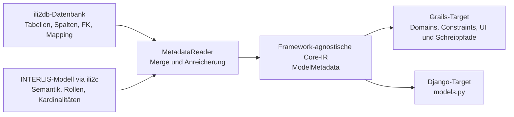

# Warum ili2grails das INTERLIS-Datenmodell braucht

Der aktuelle Produkt-, Reader- und Generatorvertrag steht in der
[README](../README.md). Dieses Dokument vertieft ausschließlich die fachliche
Begründung des Hybridansatzes.

ili2grails ist nicht einfach ein Generator, der aus Datenbanktabellen CRUD-Masken
erzeugt. Die Datenbank bleibt zwar die verbindliche Quelle für die physische
Persistenz, sie beschreibt aber nur teilweise, welche fachliche Bedeutung ihre
Tabellen, Spalten und Fremdschlüssel haben.

Die zentrale Unterscheidung lautet:

> **Die ili2db-Datenbank sagt, wie die Daten gespeichert sind. Das
> INTERLIS-Datenmodell sagt, was diese Daten fachlich bedeuten.**

Erst die Kombination erlaubt es, eine physisch korrekte und zugleich fachlich
sinnvolle Anwendung zu generieren. Ohne Modellanreicherung bleibt ili2grails
funktionsfähig: Tabellen, Spalten und einfache Fremdschlüssel können weiterhin
gelesen und als grundlegendes CRUD abgebildet werden. Bei komplexeren
Beziehungen fehlen jedoch genau die Informationen, die für eine korrekte und
sichere Bedienoberfläche benötigt werden.

## Zwei Quellen mit unterschiedlichen Aufgaben

Die von ili2db angelegte Datenbank enthält mehr Informationen als ein beliebiges
SQL-Schema. Neben den eigentlichen Tabellen und Constraints stehen
ili2db-Metatabellen zur Verfügung, beispielsweise `t_ili2db_classname`,
`t_ili2db_attrname`, `t_ili2db_inheritance` und
`t_ili2db_column_prop`. Dadurch kann der Reader INTERLIS-Namen bereits teilweise
mit physischen Tabellen und Spalten verbinden.

Trotzdem sind die Aufgaben der beiden Quellen verschieden:

| DB/ili2db weiss | INTERLIS/ili2c weiss |
| --- | --- |
| Exakter Tabellen- und Spaltenname | Fachlicher Klassen-, Attribut- und Rollenname |
| Tatsächlicher DB-Typ | INTERLIS-Typ und benannter Domain |
| Primary Keys und Foreign Keys | Reference, Composition oder Association-Rolle |
| `NULL`/`NOT NULL`, Länge, Präzision und Scale | Fachliche Kardinalität und numerischer Wertebereich |
| Physische Association- oder Link-Tabelle | Binäre, n-äre, attributierte, geordnete oder externe Association |
| Geometrietyp und SRID, soweit im DB-Schema hinterlegt | Fachliche Geometrieart und Dimensionshinweise |
| Enum-Tabelle und Display-Werte, falls angelegt | Enum-Definition, Reihenfolge, Erweiterbarkeit und Basisenum |
| Tatsächlich gewählte ili2db-Abbildung | Abstrakte Klassen und Structures ohne eigene Tabelle |
| Teilweise Units und weitere ili2db-Properties | Dokumentation und formale INTERLIS-Units |

Einige Informationen überschneiden sich bewusst. Beispielsweise kann
`MANDATORY TEXT*50` sowohl als `NOT NULL` und `VARCHAR(50)` in der Datenbank als
auch als semantische Definition im Modell erscheinen. In solchen Fällen ist das
Modell nicht die einzige Quelle, bietet aber eine zweite, fachlich
nachvollziehbare Sicht.

## Wie der Hybrid-Reader arbeitet



Der Ablauf ist in
[`MetadataReader`](../core/src/main/java/ch/interlis/generator/metadata/MetadataReader.java)
explizit abgebildet:

1. Der `Ili2dbMetadataReader` liest zuerst die physische Basisstruktur.
2. Falls eine Modelldatei oder ein Modell-Repository verfügbar ist, liest
   `Ili2cModelReader` die fachliche Semantik.
3. Klassen und Attribute werden angereichert und Beziehungen gemergt.
4. Das Ergebnis ist eine gemeinsame `ModelMetadata`-IR, aus der die Targets
   generieren.

Beim Merge gilt:

- Physische Namen und Mappings kommen aus ili2db.
- Fachliche Typen, Rollen, Kardinalitäten und Spezialsemantik kommen aus ili2c.
- Merge-Diagnosefelder halten fest, ob eine Zuordnung exakt, heuristisch oder
  gar nicht möglich war.

## Was ohne Modellanreicherung weiterhin funktioniert

Wird weder eine Modelldatei noch ein Repository angegeben, überspringt der
`MetadataReader` die ili2c-Anreicherung. Das Ergebnis ist nicht leer und die
Generierung muss nicht grundsätzlich scheitern.

Folgende Informationen bleiben verfügbar:

- exakte Tabellen- und Spaltennamen aus den ili2db-Mappings;
- Primary Keys und physische Foreign Keys;
- DB-Typen sowie daraus ableitbare Java- und Core-Typen;
- Nullability, Textlänge, numerische Präzision und Scale;
- physische Geometrieinformationen wie SRID und PostGIS-Typ;
- einfache typisierte To-One-Properties aus Foreign Keys;
- Enum-Domain und Enum-Werte, sofern die benötigten ili2db-Properties und
  Enum-Tabellen tatsächlich vorhanden sind;
- Vererbungsinformationen, soweit sie in den ili2db-Metatabellen materialisiert
  sind.

Der Post-Processing-Schritt kann fehlende Typinformationen aus dem DB-Typ
ableiten. Eine `VARCHAR`-Spalte wird dadurch beispielsweise zu `TEXT`/`String`,
eine `DATE`-Spalte zu `DATE`/`LocalDate` und eine numerische Spalte zu einem
passenden numerischen Typ.

Für einfache, tabellenorientierte Datenbestände entsteht damit weiterhin ein
brauchbares CRUD. Die Grenzen werden dort sichtbar, wo dieselbe physische
Struktur mehrere fachliche Bedeutungen haben kann.

## Was ohne Modell fehlt oder unsicher bleibt

### Ein Foreign Key kennt seine fachliche Bedeutung nicht

Ein FK sagt zunächst nur: Ein Wert in Spalte A verweist auf einen Wert in
Tabelle B. Daraus folgt nicht zuverlässig, ob es sich um

- eine normale Referenz,
- einen Bestandteil einer Composition,
- eine Rolle in einer Association,
- eine externe Referenz oder
- eine geordnete Beziehung

handelt.

Der DB-Reader erzeugt deshalb zunächst eine physische Beziehung mit
`semanticKind = ILI2DB_FK`. Erst ili2c kann sie als
`REFERENCE_ATTRIBUTE`, `COMPOSITION_ATTRIBUTE` oder `ASSOCIATION_ROLE`
klassifizieren und zusätzliche Flags setzen.

### Die Nullability einer FK-Spalte ist nicht die Rollenkardinalität

In einer Association-Tabelle verweist jede einzelne Zeile beispielsweise auf
genau eine `Person`. Die FK-Spalte ist deshalb `NOT NULL`. Daraus lässt sich
aber nicht ableiten, ob eine Person an keiner, einer oder beliebig vielen
Association-Instanzen teilnehmen darf.

Die physische Spalte beschreibt die Kardinalität innerhalb einer Zeile. Die
INTERLIS-Rolle beschreibt die fachliche Kardinalität über alle
Association-Instanzen hinweg. Diese Unterscheidung ist für Min-/Max-Prüfungen
und die Wahl der Bedienoberfläche entscheidend.

### Unsichere Association-Merges bleiben konservativ

DB-only-Beziehungen und Association-Rollen starten mit
`MergeConfidence.NONE`. Der
[`GrailsAssociationPlanner`](../target-grails/src/main/java/ch/interlis/generator/grails/GrailsAssociationPlanner.java)
verwendet eine Rolle mit dieser Confidence nicht als Grundlage für einen
schreibbaren Association-Kontext. Dadurch wird kein riskanter Quick-Link auf
Basis einer bloss vermuteten Zuordnung freigeschaltet.

Das ist ein wichtiger Sicherheitsmechanismus, hat aber eine praktische Folge:
Ohne Modellanreicherung bleibt eine Association eher eine technische
Association-Domain oder eine konservative Read-only-Sicht. Die komfortable
Bearbeitung aus Sicht der beteiligten Fachobjekte kann nicht sicher generiert
werden.

### Modell-only-Elemente sind in der Datenbank nicht sichtbar

Abstrakte Klassen und nicht materialisierte Structures besitzen je nach
ili2db-Abbildungsstrategie keine eigene Tabelle. Sie können deshalb aus der
Datenbank allein fehlen. Das Modell bewahrt diese Elemente und erklärt
insbesondere, welche Structure über eine Composition tatsächlich benötigt
wird.

## Konkrete Vorher-/Nachher-Beispiele

Die folgenden Beispiele stammen aus den versionierten Testmodellen. Wo die
physische Abbildung relevant ist, wird zwischen dem realen ili2pg-Smoke-Test
und der synthetischen H2-Testdatenbank unterschieden. Diese Unterscheidung ist
wichtig: ili2db kann dieselbe fachliche Association je nach Abbildungsstrategie
als FK auf einer beteiligten Klasse oder als eigene Link-Tabelle materialisieren.

### 1. Eine Association, aber nur ein physischer FK

Das Modell
[`AssociationCases.ili`](../test-models/AssociationCases.ili) enthält:

```ili
ASSOCIATION PhysicalMismatchAssociation =
  SemanticOwner -- {1} Person;
  OwnedParcel -- {0..*} Parcel;
END PhysicalMismatchAssociation;
```

Beim realen ili2pg-Import mit `--createFk --nameByTopic
--smart2Inheritance` entsteht dafür **keine** Tabelle
`PhysicalMismatchAssociation` mit zwei Fremdschlüsseln. ili2pg bettet die
Beziehung auf der mehrfach vorkommenden Seite ein:

```text
base_parcel.semanticowner -> base_person.t_id
```

`OwnedParcel` ist keine Tabelle und keine zweite FK-Spalte. Es ist die
Gegenrolle: Aus Sicht einer `Person` bezeichnet sie die Menge jener `Parcel`,
deren `semanticowner` auf diese Person zeigt. Bei der abgeleiteten Klasse
`ExtendedParcel` wird der FK aufgrund der gewählten
`smart2Inheritance`-Abbildung entsprechend in deren physischer Tabelle
materialisiert.

#### DB sieht

- die Tabellen `base_parcel` und `base_person`;
- die Spalte `base_parcel.semanticowner`;
- einen Foreign Key auf `base_person.t_id`;
- Nullability und DB-Constraints dieser Spalte.

#### Modell ergänzt

- dass der FK zur Association `PhysicalMismatchAssociation` und zur Rolle
  `SemanticOwner` gehört;
- die nicht als FK gespeicherte Gegenrolle `OwnedParcel`;
- die fachlichen Kardinalitäten `{1}` und `{0..*}`;
- die beiden Perspektiven der Association: Owner einer Parcel und Parcels
  einer Person.

#### Mit Anreicherung

Der Merge verbindet die physische Spalte `semanticowner` mit der fachlichen
Rolle `SemanticOwner` und ergänzt die Gegenrolle `OwnedParcel`. Der
`GrailsAssociationPlanner` erkennt die Speicherform
`EMBEDDED_FOREIGN_KEY`. Im aktuellen Stand erzeugt er dafür zwei fachlich
benannte, aber schreibgeschützte Association-Kontexte und keine erfundene
Link-Tabelle. Dieses Verhalten ist im
[`RealIli2dbSmokeTest`](../target-grails/src/realIli2dbSmokeTest/java/ch/interlis/generator/grails/RealIli2dbSmokeTest.java)
abgesichert.

#### Ohne Anreicherung

Der eine physische FK kann weiterhin als To-One-Property erzeugt werden. Aus
ihm allein lässt sich aber nicht zuverlässig rekonstruieren, dass er Teil
dieser benannten INTERLIS-Association ist, wie die Gegenrolle heisst und dass
sie die Kardinalität `{0..*}` besitzt. Die Sicht „alle `OwnedParcel` dieser
Person“ bleibt damit eine bloss technisch ableitbare inverse FK-Beziehung ohne
abgesicherte fachliche Semantik.

#### Warum zeigt der H2-Snapshot trotzdem zwei FKs?

Die synthetische Testdatenbank in
[`MetadataTestFixtures`](../core/src/testFixtures/java/ch/interlis/generator/testsupport/MetadataTestFixtures.java)
legt absichtlich eine Tabelle `physicalmismatchassociation` mit `owner_fk` und
`parcel_fk` an. Damit wird getestet, ob der Merge abweichende physische Namen
den Rollen `SemanticOwner` und `OwnedParcel` korrekt zuordnet. Der daraus
generierte
[`PhysicalMismatchAssociation.groovy`](../target-grails/src/test/resources/grails-snapshots/association-cases/grails-app/domain/ch/example/association/domain/PhysicalMismatchAssociation.groovy)
ist ein Snapshot dieses **synthetischen H2-Fixtures**, nicht der tatsächlichen
ili2pg-Abbildung des Modells. Er belegt die Merge-Logik, darf aber nicht als
Darstellung des realen Datenbankschemas gelesen werden.

### 2. Zwei Rollen mit derselben Zielklasse

Ebenfalls in `AssociationCases.ili`:

```ili
ASSOCIATION SameTargetAssociation =
  PrimaryPerson -- {0..1} Person;
  SecondaryPerson -- {0..1} Person;
END SameTargetAssociation;
```

#### DB sieht

Beim realen ili2pg-Import liegt ein einzelner Self-FK
`base_person.primaryperson -> base_person.t_id` vor. Die Datenbank zeigt damit
eine gerichtete Selbstreferenz, aber keine zweite FK-Spalte für die
Gegenrichtung.

#### Modell ergänzt

Die beiden fachlich verschiedenen Rollen `PrimaryPerson` und
`SecondaryPerson` samt ihren Kardinalitäten, obwohl beide dieselbe Zielklasse
haben. Damit erhält auch die inverse Perspektive einen eindeutigen Namen.

#### Mit Anreicherung

Der Planner kann zwei eindeutig benannte Association-Kontexte
`PrimaryPerson` und `SecondaryPerson` unterscheiden. Weil die reale
Speicherform ein eingebetteter FK ist, bleiben beide im aktuellen Stand
Read-only; es wird weder ein zweiter FK noch eine Link-Tabelle erfunden.

#### Ohne Anreicherung

Die Selbstreferenz bleibt als FK nutzbar. Die Datenbank liefert aber keinen
fachlich abgesicherten Namen für die inverse Perspektive. Ein Fallback nur über
die Zielklasse wäre mehrdeutig, weil Quelle und Ziel beide `Person` sind.

### 3. Leere, attributierte und n-äre Associations

`AssociationCases.ili` enthält mehrere absichtlich unterschiedliche Fälle:

```ili
ASSOCIATION EmptyAssociation =
  PersonRole -- {0..*} Person;
  ParcelRole -- {0..1} Parcel;
END EmptyAssociation;

ASSOCIATION AssociationWithAttribute =
  PersonRole -- {0..*} Person;
  DocumentRole -- {0..*} Document;
  RoleNote: TEXT*30;
END AssociationWithAttribute;

ASSOCIATION ExtendedTopicAssociation =
  ExtendedPersonRole -- {0..*} Person;
  ExtendedParcelRole -- {0..1} ExtendedParcel;
END ExtendedTopicAssociation;

ASSOCIATION TernaryAssociation =
  PersonRole -- {0..*} Person;
  ParcelRole -- {0..*} Parcel;
  DocumentRole -- {0..1} Document;
  Note: TEXT*50;
END TernaryAssociation;
```

#### DB sieht

- `EmptyAssociation` wird im realen Import in FK-Spalten auf einer beteiligten
  Klassentabelle eingebettet; eine eigene Association-Tabelle existiert nicht;
- `AssociationWithAttribute` wird als Link-Tabelle mit zwei FKs und der Spalte
  `rolenote` materialisiert;
- `ExtendedTopicAssociation` wird als Link-Tabelle mit zwei FKs, aber ohne
  eigenes Fachattribut materialisiert;
- `TernaryAssociation` wird als Link-Tabelle mit drei FKs und der Spalte `note`
  materialisiert.

Aus den Zusatzspalten lässt sich vermuten, dass die Link-Zeile eigene Daten
trägt. Eine vollständige fachliche Association-Semantik ist damit aber noch
nicht beschrieben.

#### Modell ergänzt

- die genaue Anzahl und Bedeutung der Rollen;
- die Rollenkardinalitäten;
- die Unterscheidung zwischen Rollen und eigenen Association-Attributen;
- die Aussage, dass `RoleNote` beziehungsweise `Note` zur Association und
  nicht zu einer der beteiligten Klassen gehört.

#### Mit Anreicherung

Der Association-Planner kann verschiedene Bedienformen wählen:

- `EmptyAssociation`: `EMBEDDED_FOREIGN_KEY` und im aktuellen Stand Read-only;
- `ExtendedTopicAssociation`: echte binäre Link-Tabelle ohne eigene Attribute,
  deshalb Quick-Link mit direktem Zuordnen und Entfernen;
- `AssociationWithAttribute`: kontextuelles Formular, weil beim Erstellen auch
  `RoleNote` erfasst werden muss;
- `TernaryAssociation`: n-äres kontextuelles Formular mit einer festen und
  mehreren auswählbaren Rollen.

Die Association-Domain bleibt in allen Fällen die persistente Wahrheit. Die
App erfindet keine synthetische Many-to-Many-Tabelle.

#### Ohne Anreicherung

Ein generisches CRUD für die vorhandenen physischen Link-Tabellen ist weiterhin
möglich; eine eingebettete Association erscheint als gewöhnlicher FK. Ein
direktes Verknüpfen aus Sicht eines Fachobjekts kann aber nicht sicher aktiviert
werden, weil Rollen, Kardinalitäten und Merge-Vertrauen fehlen. Eine n-äre
Association könnte ausserdem fälschlich wie eine gewöhnliche binäre
Many-to-Many-Beziehung behandelt werden, wenn man nur nach Tabellenform
heuristisch entscheiden würde. ili2grails vermeidet diese Vereinfachung.

### 4. `EXTERNAL`, Composition und `ORDERED`

Das Testmodell enthält:

```ili
ASSOCIATION ExternalCompositeAssociation =
  Owner (EXTERNAL) -<#> {1} Person;
  Buildings -- {0..*} Building;
END ExternalCompositeAssociation;

ASSOCIATION OrderedAssociation =
  Owner -- {1} Person;
  Docs (ORDERED) -- {0..*} Document;
END OrderedAssociation;
```

#### DB sieht

Foreign Keys und allenfalls technische Zusatzspalten. Ein FK trägt jedoch
nicht von sich aus die Bedeutung `EXTERNAL`, Composition oder `ORDERED`.

#### Modell ergänzt

- `Owner` ist extern;
- `Owner` ist eine Kompositionsrolle;
- `Docs` ist geordnet;
- die vollständigen Min-/Max-Kardinalitäten der Rollen.

#### Mit Anreicherung

Der `GrailsAssociationPlanner` schliesst Rollen mit `ordered`, `external` oder
`composition` vom einfachen Quick-Link-Modus aus. Im realen ili2pg-Smoke-Test
werden `ExternalCompositeAssociation` und `OrderedAssociation` zudem als
eingebettete FKs erkannt und deshalb im aktuellen Stand Read-only dargestellt.
Die generierte Association-Registry führt die semantischen Flags explizit,
sodass auch die Runtime sie prüfen kann.

#### Ohne Anreicherung

Alle drei Fälle sehen zunächst wie normale FKs aus. Ein naiver CRUD-Generator
könnte einen einfachen Link-Editor anbieten, der keine Reihenfolge führt,
externe Grenzen ignoriert oder eine Composition wie eine gewöhnliche Referenz
behandelt. DB-only ili2grails gibt solche semantisch unbestätigten
Association-Schreibpfade nicht als Quick-Link frei.

### 5. Structures und Composition-Attribute

Das Modell
[`StructureCompositionCases.ili`](../test-models/StructureCompositionCases.ili)
definiert:

```ili
STRUCTURE Part =
  Label: MANDATORY TEXT*50;
  OwnerRef: REFERENCE TO Owner;
END Part;

CLASS Asset =
  Name: MANDATORY TEXT*50;
  Parts: LIST {0..*} OF Part;
  MainInspection: BAG {1} OF Inspection;
  OptionalAttachment: BAG {0..1} OF Attachment;
END Asset;
```

#### DB sieht

Je nach ili2db-Abbildungsstrategie Tabellen, Hilfstabellen oder FKs. Bei nicht
materialisierten Structures kann eine eigenständige Tabelle vollständig
fehlen. Die DB-Form allein erklärt nicht zuverlässig, dass `Part`,
`Inspection` und `Attachment` Bestandteile von `Asset` sind.

#### Modell ergänzt

- `Part`, `Inspection` und `Attachment` sind Structures;
- `Parts` ist eine geordnete, unbeschränkte Composition;
- `MainInspection` ist genau einmal erforderlich;
- `OptionalAttachment` darf null oder genau einmal vorkommen.

#### Mit Anreicherung

Der Snapshot
[`Asset.groovy`](../target-grails/src/test/resources/grails-snapshots/structure-composition/grails-app/domain/ch/example/structure/domain/Asset.groovy)
zeigt die unterschiedlichen Abbildungen:

```groovy
Inspection mainInspection
Attachment optionalAttachment

static hasMany = [parts: Part]

static constraints = {
    optionalAttachment nullable: true
}
```

Der `GrailsRelationshipMapper` generiert eine Structure auch ohne eigenes
physisches Mapping, wenn sie als Ziel einer Composition benötigt wird.

#### Ohne Anreicherung

Eine nicht materialisierte Structure ist aus der Datenbank nicht
rekonstruierbar. Damit fehlen entweder die Klasse selbst oder die Information,
weshalb sie als Collection beziehungsweise To-One-Bestandteil von `Asset`
benötigt wird. Ein vorhandener FK könnte nur als gewöhnliche Referenz
erscheinen.

### 6. Fachlicher Wertebereich statt nur DB-Typ

In [`ListQueryE2E.ili`](../test-models/ListQueryE2E.ili) steht:

```ili
!! Record year
!!@ ch.ehi.ili2db.unit=Jahr
Year: 1900 .. 2200;
```

#### DB sieht

Typischerweise eine numerische Spalte, beispielsweise `INTEGER`, und eventuell
die Unit aus `t_ili2db_column_prop`. Der aktuelle DB-Reader wertet keine
beliebigen SQL-Check-Constraints als INTERLIS-Wertebereich aus.

#### Modell ergänzt

Den fachlichen Wertebereich `1900 .. 2200`. Bei formalen numerischen
INTERLIS-Typen kann ili2c zusätzlich die Unit sowie Precision und Scale
liefern.

#### Mit Anreicherung

`minValue` und `maxValue` gelangen in die Core-IR und der
[`GrailsDomainGenerator`](../target-grails/src/main/java/ch/interlis/generator/grails/GrailsDomainGenerator.java)
erzeugt daraus GORM-Constraints:

```groovy
year min: 1900, max: 2200
```

Ungültige Werte werden damit bereits durch die generierte Domain validiert und
nicht erst durch eine spätere Fachprüfung entdeckt.

#### Ohne Anreicherung

Die Property bleibt numerisch und kann weiterhin gespeichert werden. Ohne
zusätzlichen DB-Check oder manuelle Konfiguration weiss die generierte Domain
aber nicht, dass beispielsweise `1800` oder `2500` fachlich ungültig ist.

### 7. Dokumentation und Units im Formular

In
[`SimpleAddressModel.ili`](../test-models/SimpleAddressModel.ili) sind
`FirstName` und `LastName` dokumentiert:

```ili
/** Vorname */
FirstName: MANDATORY TEXT*50;

/** Nachname */
LastName: MANDATORY TEXT*50;
```

#### DB sieht

Zwei Pflicht-Textspalten mit einer maximalen Länge von 50 Zeichen. Die
Bedeutung „Vorname“ beziehungsweise „Nachname“ ist im SQL-Schema nicht
enthalten.

#### Modell ergänzt

Attributdokumentation und fachlichen Attributnamen.

#### Mit Anreicherung

Der generierte Snapshot
[`Person.groovy`](../target-grails/src/test/resources/grails-snapshots/simple-address/grails-app/domain/ch/example/simple/domain/Person.groovy)
enthält:

```groovy
firstname: [
    label: 'firstName',
    documentation: 'Vorname',
    qualifiedName: 'SimpleAddressModel.Addresses.Person.firstName'
]
```

Das Bootstrap-Template
[`_form-section.gsp`](../target-grails/src/main/resources/grails/overlays/bootstrap-openlayers/src/main/templates/scaffolding/_form-section.gsp)
rendert `documentation` als Hilfetext und `unit` als sichtbares Unit-Badge. Die
Information ist damit nicht nur in einer Metadatendatei vorhanden, sondern
erreicht die Person, die Daten erfasst.

#### Ohne Anreicherung

Das Textfeld und seine Längenvalidierung funktionieren weiterhin. Als
Beschriftung bleibt aber nur ein technischer oder aus dem Attributnamen
abgeleiteter Name; der fachliche Hilfetext fehlt.

### 8. Enumerationen

`SimpleAddressModel` definiert:

```ili
DOMAIN
  AddressStatus = (
    active,
    inactive,
    proposed
  );
```

#### DB sieht

Abhängig von den ili2db-Importoptionen:

- mit Enum-Tabelle: Enum-Domain, Codes, Reihenfolge und Display-Namen können
  teilweise aus ili2db gelesen werden;
- ohne materialisierte Enum-Tabelle: möglicherweise nur eine Textspalte und
  eine Enum-Domain-Property, aber keine vollständige `EnumMetadata`-Definition.

#### Modell ergänzt

Die Enum-Definition unabhängig von der physischen Speicherung sowie
Reihenfolge, Erweiterbarkeit und ein mögliches Basisenum.

#### Mit Anreicherung

ili2grails erzeugt eine typisierte Grails-Enum:

```groovy
enum AddressStatus {
    active, inactive, proposed
}
```

Die Property kann damit als Enum statt als beliebiger String behandelt werden.

#### Ohne Anreicherung

Bei vorhandener ili2db-Enum-Tabelle können Auswahllisten weiterhin
funktionieren. Fehlt diese physische Tabelle, bleibt eher eine String-Property;
die zulässigen Codes können dann nicht vollständig aus dem DB-Schema
rekonstruiert werden.

### 9. Geometrie: physischer Typ und fachliche Art

#### DB sieht

PostGIS kann SRID und einen konkreten Typ wie `POINT` oder `MULTIPOLYGON`
liefern. Bei einer generischen `GEOMETRY`-Spalte ist die Aussage weniger
spezifisch.

#### Modell ergänzt

Die INTERLIS-Typen `COORD`, `POLYLINE`, `SURFACE`, Multi-Geometrien sowie
Dimensionshinweise. Damit ist die Geometrieart nicht allein von der konkreten
DB-Typdeklaration abhängig.

#### Mit Anreicherung

Die Core-IR führt `geometryKind`, `geometrySrid`, Z-/M-Hinweise und
`allowEmptyGeometry`. Das Grails-Target schreibt diese Informationen in
`geometryMeta`. Formular und Geometry-Binder können den erwarteten Typ prüfen
und den passenden Karteneditor konfigurieren.

#### Ohne Anreicherung

Bei einem präzisen PostGIS-Typ bleibt vieles funktionsfähig. Bei einer
generischen Geometry-Spalte fehlen dagegen Informationen für eine spezifische
Typprüfung und UI-Konfiguration.

## Wo der praktische Nutzen am grössten ist

### 1. Association-Semantik

Hier ist der Unterschied zwischen Speicherstruktur und fachlicher Bedeutung am
grössten. Rollen, Kardinalitäten, eigene Attribute und Spezialflags bestimmen,
wie Beziehungen dargestellt und verändert werden dürfen.

### 2. Composition und Structures

Das Modell verhindert, dass Bestandteile als gewöhnliche Referenzen behandelt
oder nicht materialisierte Structures vollständig übersehen werden.

### 3. Sichere Schreib-UX

Quick-Link, kontextuelles Formular, n-äre Darstellung und Read-only-Fallback
sind keine rein visuellen Varianten. Sie entscheiden, welche
Persistenzoperation fachlich zulässig und technisch eindeutig ist.

### 4. Validierung und Erfassungshilfe

Wertebereiche, Dokumentation und Units verbessern die Datenqualität direkt bei
der Eingabe. Textlänge und Mandatory überschneiden sich häufig mit der DB;
numerische Wertebereiche und Dokumentation sind dagegen echte zusätzliche
Semantik.

### 5. Enums und semantische Typen

Sie machen die generierte Anwendung weniger abhängig von einer bestimmten
physischen ili2db-Abbildung und stellen stabilere Verträge für mehrere Targets
bereit.

## Was „mehr als CRUD“ hier bedeutet

ili2grails erzeugt weiterhin Create-, Read-, Update- und Delete-Funktionen. Der
Unterschied liegt nicht darin, CRUD abzuschaffen, sondern darin, die
Generierungsentscheidungen aus einem fachlichen Modell abzuleiten:

- Welche Klassen sollen überhaupt als Domain erscheinen?
- Ist ein FK eine Referenz, ein Bestandteil oder eine Association-Rolle?
- Ist die Beziehung optional, mehrfach, geordnet oder extern?
- Darf sie als direkter Quick-Link verändert werden?
- Benötigt sie ein eigenes Formular mit Association-Attributen?
- Welche Werte und Typen sind fachlich zulässig?
- Welche Hilfe soll im Formular angezeigt werden?

Damit ist ili2grails ein **modellgetriebener Fachapplikations-Generator mit CRUD
als Ausgabemechanismus**. Es ist jedoch kein Generator für beliebige
Geschäftsprozesse, Berechtigungsmodelle, Workflows oder fachliche
Transaktionsgrenzen. Solche Regeln bleiben Aufgabe der konkreten Anwendung.

## Aktuelle Grenzen

Die Core-IR ist bereits auf zusätzliche Semantik vorbereitet. Nicht alles, was
INTERLIS ausdrücken kann, wird heute vollständig gelesen oder von jedem Target
genutzt:

- Lokalisierte Labels sind in `ClassMetadata`, `AttributeMetadata` und
  `EnumMetadata` vorgesehen. Der aktuelle `Ili2cModelReader` befüllt diese
  Label-Maps jedoch noch nicht.
- Allgemeine INTERLIS-Constraints wie `UNIQUE`, Plausibility-, Existence- und
  Set-Constraints werden noch nicht ausgewertet.
- Enum-Erweiterbarkeit und Basisenums stehen in der Core-IR, werden vom
  Grails-Enum-Generator aber noch nicht fachlich umgesetzt.
- Klassendokumentation ist derzeit vor allem in Core-IR, JSON und
  Metadatenausgabe sichtbar. Attributdokumentation wird bereits bis in die
  Formulare geführt.
- Mandatory, Textlänge, Units, Geometrietyp und Enum-Informationen können sich
  mit DB- beziehungsweise ili2db-Metadaten überschneiden. Der zusätzliche
  Nutzen hängt von der verwendeten ili2db-Konfiguration und
  Abbildungsstrategie ab.
- Das INTERLIS-Modell muss dieselbe Modellversion repräsentieren, die für den
  ili2db-Import verwendet wurde. Bei abweichenden Versionen können Attribute
  und Beziehungen nicht oder falsch gemergt werden. Der Merge-Report und seine
  Confidence-Felder sind deshalb für reale Modelle wichtig.

Diese Grenzen ändern nichts am Hybridprinzip. Sie zeigen vielmehr, wo weitere
INTERLIS-Semantik künftig zusätzlichen Nutzen schaffen kann und wo die
Anwendung heute bereits konkret davon profitiert.
